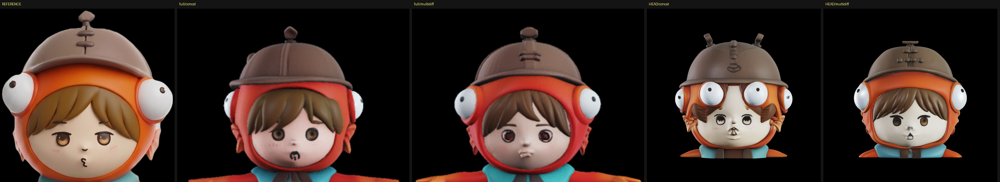
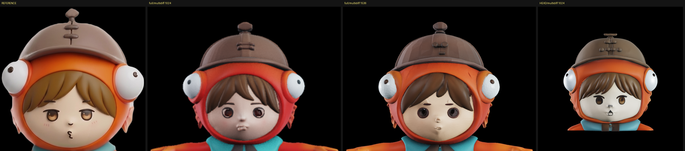
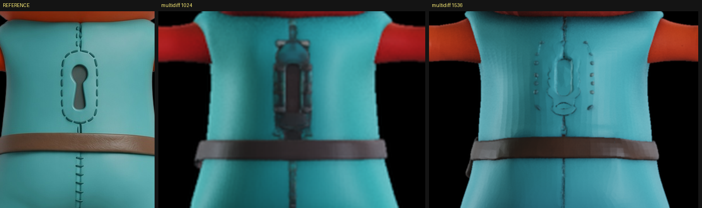
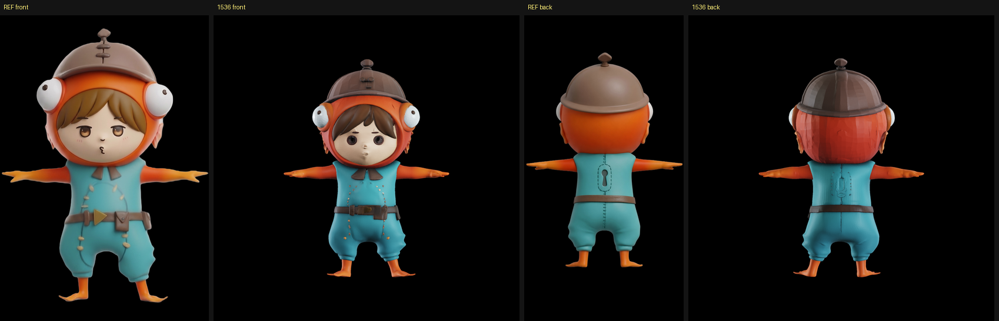

# 顔が似ていない件の切り分け（2026-08-30）

[多視点条件付け](2026-08-30-multiview-conditioning.md)で後ろの破綻は直ったが、**顔が元の絵に
似ておらず、目と口が不気味**という指摘を受けた。原因を切り分ける。

最初の仮説は「顔に割り当てられる解像度が足りない」。入力は全身 1 枚で、`preprocess_image` が
bbox で正方形に切って 512px（疎構造）/ 1024px（形・テクスチャ）に落とすため、顔は 100px 程度、
目は数ピクセルしかない。ボクセルも全身で分け合う。

## 試したこと

| | 中身 | 所要 | 頂点 | VRAM |
|---|---|---|---|---|
| `head_concat` | 頭だけ 4 枚・`concat`・1024 | 198s | 6,415,665 | 8.13 GB |
| `head_multidiff` | 頭だけ 4 枚・`multidiffusion`・1024 | 379s | 5,795,494 | 7.73 GB |
| `full1536_multidiff` | 全身 4 枚・`multidiffusion`・**1536** | 688s | 7,917,021 | 10.03 GB |

頭部の切り出しは、シルエットの幅が上半分で最小になる行（＝首）を自動検出して切った。

## 1. 頭だけの切り出しは**悪化した**（仮説が外れた）

顔が崩れ、目が二重にぶれ、兜に棘のような突起が出た。

**原因は視点の位置合わせの失敗**と見ている。全身なら輪郭が手がかりになるが、頭だけだとほぼ球体で、
左右の絵は魚のヒレの近接、背面はただのドーム。**どの絵がどの向きか対応づけられない**ので特徴が
混ざる。ADR-0005 に書いた「連結したトークンにはどれがどの向きの絵かという情報が無い」という
限界が、頭だけにすると致命傷になる。

**パーツ単位の生成をやるなら、視点の対応づけを別に与える必要がある。** 最終ゴール（顔や体を
パーツとして作る）に直結する制約なので、ここは覚えておく。

## 2. 解像度 1536 は**明確に効いた**

| | 1024 | **1536** |
|---|---|---|
| 兜のてっぺんの突起 | 2 段 | **3 段**（元の絵と一致） |
| 眉毛 | 無い | **出た** |
| 口 | 茶色いシミ | 小さくなった |
| フードの色（背面） | 赤 | オレンジ寄り |

背中の鍵穴はもっとはっきり差が出た。

1024 は立体的な金具のような別物だったが、**1536 では破線の楕円が正しい位置・正しい形で出た**。
両脇の破線と中央の縫い目も出ている。楕円の中の鍵穴そのものはまだ出ていない。

全身で見た 1536 の出来:

## 3. 2048 は時間的に使えない

`sample_shape_slat_cascade` の `resolution` に 2048 を渡し、`max_num_tokens` を 200000 に上げれば
2048 で走る（上流の `pipeline_type` の列挙は 1536 止まりだが、関数を直接呼べば渡せる）。
実際に走りはしたが、高解像度ステージが **240 秒/ステップ × 12 = 約 48 分**、全体で 1 時間超の
見込みだったため途中で止めた。

**ただしこの数字は割り引いて読むこと。** 測っている最中、別の実験プロセスが同じ GPU を使っており、
取り合いになっていた。単独で走らせればもっと速いはずで、**2048 が使えないと断定はできない**。
再測するなら GPU を空けてから。

## 残っている問題: 目が彫り込まれる

解像度を上げても消えなかったのがこれ。

**元の絵の目は平たく塗られている**（フィギュアの顔にプリントされた目）。一方、生成物は
**目を彫り込んでいる**。眼球が奥まって影になるため、暗く落ち窪んで見える。これが「不気味」の正体。

解像度を上げると彫りが精細になるだけで、平らにはならない。TRELLIS.2 の O-Voxel は形と PBR 属性を
同時に持つ表現なので、**「塗り」と「彫り」の区別がモデルの中で付いていない**のだと見ている。

次に試すべきは、ADR-0002 で決めた工程分離を実際に使うこと。**形は 1536 で作り、顔のテクスチャ
だけを別工程（`Trellis2TexturingPipeline`）で塗り直す。** ただし彫り込まれた形はテクスチャでは
戻らないので、顔の形を平滑化する工程も要るかもしれない。

その他の未解決:

- ベルトの黄色い三角バックルが出ない（多視点にすると正面の細部が薄まる問題・ADR-0005）
- 鍵穴の楕円の中身
- フードに元の絵に無い縦の筋が入る

## 再現方法

`TRELLIS.2/gen_q.py` と `TRELLIS.2/gen_hi.py`（git 管理外）。
頭部の切り出しは Mac 側で首を自動検出して作り、`testimg_head/` へ送っている。

**GPU を空けてから 1 つずつ走らせること。** 同時に走らせると所要時間の測定が壊れる。
