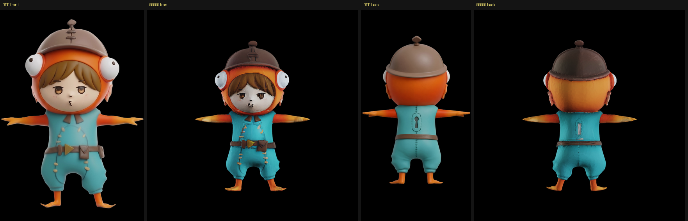
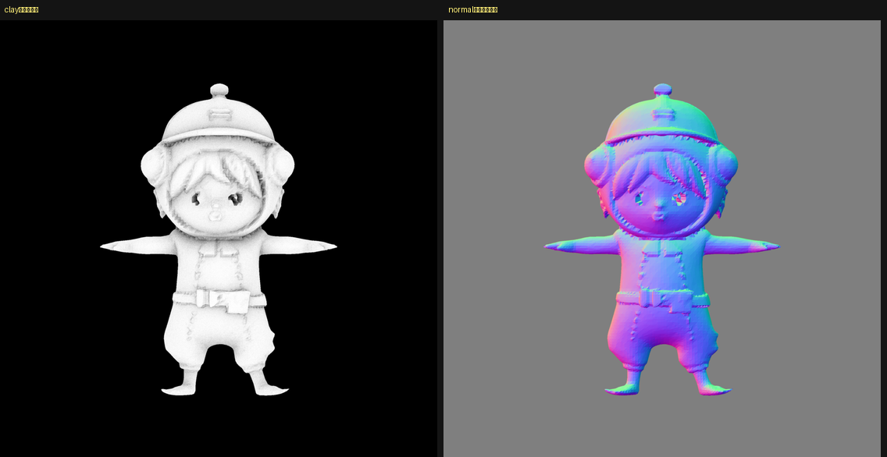
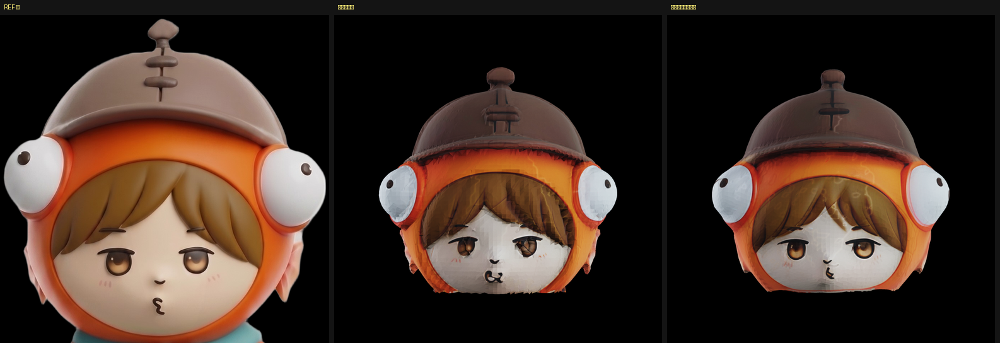
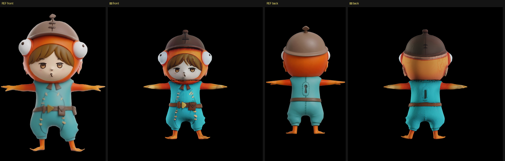

# 1体を通しで作る（2026-08-30 時点の最良）

「形は一気に、色はパーツごと」で 1 体を仕上げた。



**首の境目は見えない。** 頭と体がきれいに接いでいる。

## 通しの手順

```
1. 形を全身で作る              TRELLIS.2 + 多視点条件付け(ADR-0005)    約3分
2. リトポロジー                Blender ボクセル化 → 元表面へスナップ    約30秒
3. 全身を塗る                  Hunyuan3D-Paint 2.1（既定 texsize=4096） 55.8秒
4. 全身に元絵を投影            project_detail --mode=detail            69.6秒
5. メッシュを首で切る          断面の広がりが最小の高さを自動検出        数秒
6. 頭だけ塗り直す              Hunyuan3D-Paint 2.1（頭が512を占める）   62.5秒
7. 頭に元絵を投影              頭用に切った4枚・視点の対応づけは固定     96.0秒
8. 体を 4 から取り出して結合   UVと材質を保ったまま切り出す             数秒
```

頭・体とも 2048x2048 の専用アトラスを持つ。合計 約8分（形づくりを含む）。

## なぜこの順番なのか

| | 一気に | パーツごと |
|---|---|---|
| **形** | ○ 4枚の対応づけに全身の輪郭が要る | × 頭だけだと球形で対応づけられない |
| **色** | △ 顔に割ける画素が足りない | ○ 小さいパーツほど 512px の生成に大きく写る |

どちらも今日の実測にもとづく。
[頭部切り出しの失敗](2026-08-30-face-quality.md) / [パーツ別テクスチャ](2026-08-30-part-textures.md)

## 体パーツを単独で塗り直さなかった理由

当初は体も切り出して塗り直す予定だったが、**元絵の投影が体パーツ単体では成立しなかった**。

- 手で「首の高さ」で切った絵 … シルエットの一致 0.39〜0.72（閾値 0.8）→ **1画素も貼れず**
- パーツの投影した外接矩形で自動切り出し … 0.45〜0.67 → 同じく貼れず
- パーツのシルエットで元絵をマスク … **0.29〜0.48 とさらに悪化**

原因は `apply_detail` が**絵とメッシュをそれぞれ自分の高さで再正規化する**こと。全身どうしなら
対応するが、パーツでは対応しない。頭がうまくいったのは、頭が全身の上端を含んでいて正規化が
たまたま噛み合ったためと見ている。

そこで**全身で塗って投影したもの（実証済み・貼れた画素 46.60%）から体だけを取り出す**ことにした。
体のアトラスは全身と共有だが、体は顔ほど密度を必要としない。

**パーツごとの投影を成立させるには、`apply_detail` に「全身の正規化を渡す」口が要る。**
いまは中で勝手に正規化している。ここは残件。

## 残っていること

- 顔がまだ元の絵より小さく、輪郭が甘い
- テクスチャに筋状のノイズが残る
- 体パーツ単独での投影（上記の残件）
- 首の切り口は塞いでいない（見えないので実害は無い）

## 道具

> **★2026-08-31 追記**: このうち `bake_to_uv.py` と `crop_ref_for_part.py` は
> [`experiments/`](../../experiments/README.md) へ移した（本線で使っていないため）。
> 下の表のパスは当時のもの。**そのまま実行するとファイルが無い。**


| | |
|---|---|
| `tools/retopo_shrinkwrap.py` | ボクセル化 → 元表面へスナップ |
| `tools/split_parts.py` | 首の位置を自動検出して切る |
| `tools/extract_part.py` | テクスチャ付きメッシュから UV と材質を保って切り出す |
| `tools/combine_parts.py` | パーツを 1 つの glb にまとめる（材質は分けたまま） |
| `tools/apply_reference_detail.py` | 元絵の投影（`--fixviews` で視点の対応づけを固定） |
| `tools/crop_ref_for_part.py` | パーツに対応する範囲で元絵を切る（体では力不足だった） |
| `tools/bake_to_uv.py` | xatlas 展開＋自前の焼き込み |

---

## 追記: 残件を3つとも解消した（2026-08-30）

### 1. パーツ単独での投影（解消）

`apply_detail` が絵とメッシュを**それぞれ自分の高さで再正規化する**のが原因だった。
2 つの口を足した。

- `norm_ref` … **全身の頂点**を渡すと、そちらで正規化する
- `fixfit` … 全体の位置合わせと一致の関門を飛ばす（既に合っているため）

ラッパの `--partof=全身.glb` で両方が入る。**絵は切らずに全身のものをそのまま渡す。**

| | 貼れた画素 | 所要 |
|---|---|---|
| 体・手切りの絵 | **0.00%**（一致 0.39〜0.72） | 25.4s |
| 体・投影矩形で自動切り出し | **0.00%**（0.45〜0.67） | 25.4s |
| 体・シルエットでマスク | **0.00%**（0.29〜0.48） | 25.3s |
| **体・`--partof`** | **38.16%** | **20.5s** |
| 頭・`--partof` | 41.64% → **50.06%** | 96.0s → **26.6s** |

**頭も改善し、しかも速くなった**（位置合わせの探索を飛ばせるため）。

### 2〜3. 筋状のノイズと顔の甘さ（同じ原因だった）

**仮説が外れた。** 「リトポロジー後の表面が荒れている」と考えて `clay`（形だけ）で描画したところ、
表面は荒れていなかった。



見えたのは逆のことだった。**TRELLIS.2 は髪の筋・服の縫い目・ベルト・顔の造作まで、
全部を形として彫っている。** つまり**「筋状のノイズ」の正体はテクスチャではなく、
彫られた形が光を拾っているもの**だった。目が暗く落ち窪むのと同じ原因である。

元の絵は「滑らかな面に絵が描かれた」フィギュアなので、**彫りを落として絵に任せる**。

`tools/smooth_part.py`（ラプラシアン平滑化・8回・強さ0.5）を塗る前に当てた。
動いた距離は全体の大きさの 0.5% 程度。



**フードの縁のギザギザが消え、面が滑らかになり、目の虹彩と眉がはっきりした。**

### ただし体をならすと鍵穴が消える

同じ処理を体にも当てたら、**背中の鍵穴がならしで消えた**。彫りを落とす以上、
残したい彫りも落ちる。

**答え: 頭はならす、体はならさない。**

- 頭 … 顔は「塗り」であるべきなので、彫りは邪魔にしかならない
- 体 … 鍵穴・縫い目・ベルトは彫りとして出ているほうが良い



## 通しの手順（更新）

```
1. 形を全身で作る              TRELLIS.2 + 多視点条件付け        約3分
2. リトポロジー                Blender ボクセル化 → スナップ      約30秒
3. メッシュを首で切る          断面の広がりが最小の高さを自動検出   数秒
4. 頭だけ表面をならす          ラプラシアン 8回・強さ0.5          数秒
   （体はならさない ← 鍵穴が消えるため）
5. 頭と体をそれぞれ塗る        Hunyuan3D-Paint 2.1              54.1s + 61.2s
6. それぞれに元絵を投影        --partof で全身の正規化を渡す      27.8s + 20.5s
7. 結合                        材質はパーツごとに分けたまま        数秒
```

合計 約6分（形づくりを含む）。頭・体とも 2048x2048 の専用アトラス。
