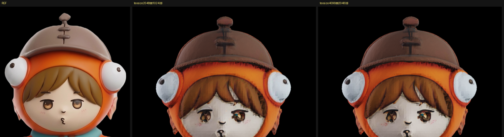
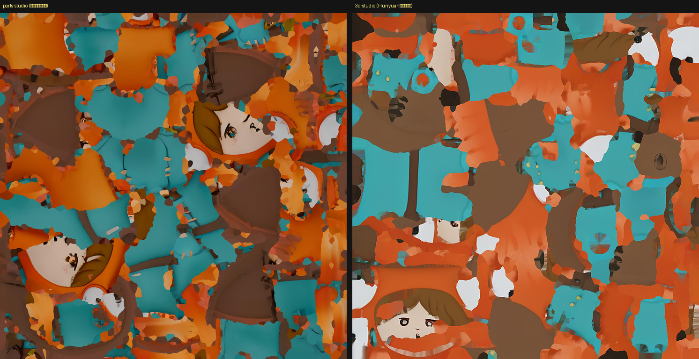

# テクスチャを Hunyuan3D-Paint 2.1 に差し替える（2026-08-30）

[元絵の投影](2026-08-30-project-detail.md)まで来ても顔が直らなかった。原因は色の**表現**
（ボクセル場）にあると切り分けたので、テクスチャ工程だけ差し替えた（[ADR-0008](../adr/0008-texture-by-hunyuan3d-paint.md)）。

## 環境は作らずに済んだ

Windows 機の `Z:\work\3d-studio` に 3d-studio の環境が丸ごと残っていた。

- `venv-21`（Python 3.12.10）… 色塗り 2.1 用
- `Hunyuan3D-2.1`（パッチ適用済み）
- `ckpt\RealESRGAN_x4plus.pth`（63.9MB）
- Hugging Face のキャッシュも共有（`models--tencent--Hunyuan3D-2.1` ほか）

**環境構築を丸ごと省けた。** 探す前に作り始めなくてよかった。

## 数字

我々のリトポロジー済みメッシュ（42,084 面）に対して:

| | 所要 | VRAM | 備考 |
|---|---|---|---|
| Hunyuan3D-Paint 2.1 | **60.5s** | 使用 12.99GB / 確保 19.23GB | PBR マップ付き（金属・ざらつき） |
| 元絵の投影 1段目（全身 detail） | 68.8s | GPU 不要 | 貼れた画素 46.53% |
| 元絵の投影 2段目（顔だけ color） | 42.0s | GPU 不要 | 16.28% |

VRAM は 3d-studio が同じ機体で測った 13.0GB と一致する。

## 顔


左から 元の絵 / TRELLIS.2 の色 / ＋元絵の投影 / **Hunyuan3D-Paint 2.1**。

**Paint 2.1 に替えただけで、目に茶色い虹彩・眉毛・口が出た。** TRELLIS.2 の色では
暗い染みだった部分である。「顔が壊れているのは色の表現であって形ではない」という切り分けが
当たった。


さらに元絵の投影を 2 段重ねると、虹彩の中の瞳孔とハイライト、眉の形、頬の赤みまで出る。
**今日の中で最良。**

## 全身


正面は 兜の 3 段の突起・オレンジのフード・目玉・ベルトの黄色い三角バックル・胸元の黄色い粒・
ヒレの手足まで揃っている。背面は フードのオレンジ・**背中の鍵穴**・中央の縫い目・ベルトが出ている。

## 残っている差

- 顔が元の絵よりわずかに小さく、フードの開口に対する比率が違う
- テクスチャに筋状のノイズが残る（特に後頭部のフード）
- 目はまだ浅い窪みの中にあるので、元の絵の完全に平らな塗りにはならない

## 通しの手順（現時点の最良）

```powershell
# 1. 形（TRELLIS.2・多視点条件付け）
cd C:\work\parts-studio\TRELLIS.2
..\venv\Scripts\python.exe gen_shape.py 1024

# 2. リトポロジー（Blender・ボクセル化→元表面へスナップ）
cd C:\work\parts-studio
.\venv-bpy\Scripts\python.exe tools\retopo_shrinkwrap.py out\uv_C_60k.glb out\vox_snap_0.009.glb 0.009

# 3. 色塗り（Hunyuan3D-Paint 2.1・3d-studio の環境を借りる）
cd Z:\work\3d-studio
.\venv-21\Scripts\python.exe paint21_pipeline.py output\ps_shape.glb output\ps_front.png output\ps_painted.glb --texsize=2048

# 4. 元絵の投影（GPU不要・2段）
cd C:\work\parts-studio
.\venv\Scripts\python.exe tools\apply_reference_detail.py out\hy_painted.glb out\hy_d1.glb --front=... --mode=detail
.\venv\Scripts\python.exe tools\apply_reference_detail.py out\hy_d1.glb out\hy_d2.glb --front=... --mode=color --top=0.26 --bottom=0.48
```

合計 約4分（形づくりを除く）。

---

## 追記: 画質が悪い件の切り分け（2026-08-30）

出力を見て「REF と比べて画質が悪い」と指摘を受けた。そのとおりだったので切り分けた。

### 1. 私の設定ミス（テクスチャが 1024 になっていた）

`--texsize=2048` を渡していたが、3d-studio の `paint21_pipeline.py` に**この罠への注意書きが
書いてあった**。

```python
# ★texture_size の【半分】が実際に出る絵の大きさです（実測：4096→2048、2048→1024）。
#   2048を指定して1024になっていたので、既定を4096に戻しました。
```

**注意書きを読まずに既定を下げていた。** 既定（4096 → 実 2048）で回し直した。

| | 所要 | VRAM | 実テクスチャ |
|---|---|---|---|
| `--texsize=2048`（誤） | 60.5s | 12.99 / 19.23 GB | 1024x1024 |
| 既定 `texsize=4096`（正） | 55.8s | 13.41 / 20.41 GB | **2048x2048** |



**わずかに締まったが、ブロック状のノイズは残った。** 解像度は主因ではなかった。

### 2. 多視点の生成解像度を上げるのは実用外

`--res=768`（既定 512）を試した。512 では 56 秒で終わるのに、**768 では VRAM 15.9GB を
使い切って 100% 稼働のまま 15 分以上**終わらず、途中で止めた。共有メモリへ溢れている。
このレバーは使えない。

### 3. 真因: 顔に割り当てられるテクセルが少ない

塗れたアトラスを 3d-studio のものと並べた。



**3d-studio（右）は顔が 1 枚の大きなチャートに収まっている。**
**こちら（左）は顔が 2 つに割れ、しかも小さい。** 全身を同じ 2048 に詰めているので、
顔に回るテクセルが少ない。

`retopo_bake_blender.py` にも同じことが書いてあった。

```
① UVを smart_project で張り替えて全身を1枚に詰め直すので、目のような
   小さい所に割り当てられる画素が減る（元絵90px→焼けた2048で約60px→さらに減る）
```

なお UV の指標自体は悪くない（我々 477 charts・上位50で 90.0%・利用率 62.0% に対し、
3d-studio は 231 charts・79.5%・57.7%）。**チャート数や利用率では、この問題は見えない。**
効くのは「顔というひとつの部位に、アトラスの何割を与えているか」。

### 打ち手

1. **顔を独立した Part として、専用のテクスチャを持たせる** — このプロジェクトの最終ゴール
   （パーツ分割）そのもの。顔だけで 2048 を使えば、いまの数倍のテクセル密度になる
2. **重要度つきの詰め込み** — 顔のチャートだけ拡大してから詰める。xatlas に機能は無いので自前
3. `texsize=8192`（→ 実 4096） — VRAM が 20.41GB 確保の時点で共有メモリに溢れており、
   さらに倍は厳しい見込み

**1 が本命。** ADR-0007 の「パーツ単位の生成は視点の対応づけを別に与えないと成立しない」
（[実測](2026-08-30-face-quality.md)）という制約と合わせて設計する必要がある。
