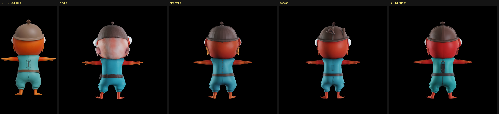
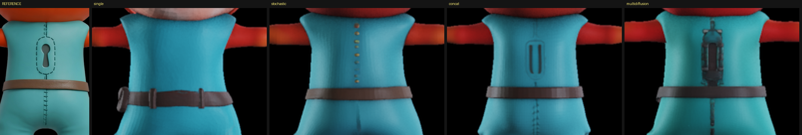
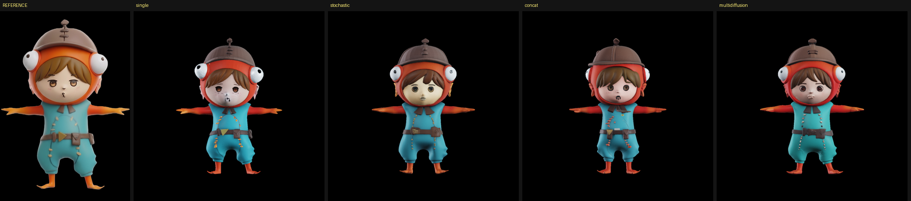

# 4枚を Reference View に昇格させる（tuning-free 多視点条件付け・2026-08-30）

[初回実行](2026-08-30-trellis2-first-real-run.md)で、正面 1 枚だけでは後ろが元の絵から
大きく外れることが確認できた。ADR-0003 の「(D) 多視点の条件付けを後段で足す」を実装して測る。

## 試した 4 方式

TRELLIS v1 が持っていた 2 方式を .2 のサンプラーへ移植し、v1 に無い 1 方式を加えた。
比較のため単視点も同じ条件で作った。

| 方式 | 中身 | 追加コスト |
|---|---|---|
| `single` | 正面 1 枚だけ（比較用の基準） | — |
| `stochastic` | ステップごとに使う View を順に切り替える（v1 由来） | ほぼ 0 |
| `concat` | 4 枚分の特徴をトークン方向に連結し `(1, 4N, 1024)` で一度に渡す（**v1 に無い**） | 小 |
| `multidiffusion` | 毎ステップ全 View で予測して平均（v1 由来） | View 数倍 |

細工を入れる位置は、サンプラーの最外層（`GuidanceIntervalSamplerMixin._inference_model`）。
CFG が `cond` と `neg_cond` を分ける**前**に View を選ぶ必要があるため。`neg_cond` は batch 1 の
まま `kwargs` を素通りする。v1 は `cond_indices.pop(0)` でステップ数ぶんの配列を先に作っていたが、
`1024_cascade` は shape サンプラーを 2 回（512 と 1024）使うので配列が尽きる。`itertools.cycle`
にして尽きないようにした。

## 数字

同じ seed（1234）・`1024_cascade`・同じ 4 枚。プロセス 1 つで連続実行。

| 方式 | 所要 | 頂点 | 面 | VRAM ピーク | RAM |
|---|---|---|---|---|---|
| `single` | 57s | 3,731,577 | 7,624,516 | 5.18 GB | 20.08 GB |
| `stochastic` | **48s** | 3,433,153 | 6,965,552 | 5.15 GB | 20.48 GB |
| `concat` | 65s | 3,835,590 | 7,828,218 | 5.58 GB | 20.48 GB |
| `multidiffusion` | 171s | 3,460,150 | 7,013,392 | 5.18 GB | 20.39 GB |

**どの方式もメモリはほぼ変わらない。** 効くのは時間だけで、`multidiffusion` が 3.6 倍。

## 見た目

### 後ろ（元の絵は条件に入っている）



**最大の失敗は直った。** `single` ではフードが肌色になっていたが、多視点 3 方式はいずれも
**赤〜オレンジ**に戻っている。兜の形も `stochastic` と `multidiffusion` は元の丸いドームに近づいた。

### 後ろの胴体（鍵穴と縫い目）



| 方式 | 背中 |
|---|---|
| REFERENCE | 縦長の鍵穴（丸い頭＋縦スリット）を点線が縁取る。下に中央の縫い目 |
| `single` | **何も無い** |
| `stochastic` | **正面の胸元の黄色い粒が背中に回り込んでいる**（View の取り違え）。縫い目は出た |
| `concat` | 縦長のオーバルの輪郭は出た。中身は縦 2 本の棒で別物。縫い目は出た |
| `multidiffusion` | 鍵穴の位置に立体的な金具のようなものを作った。位置は合うが形は別物。縫い目は出た |

**中央の縫い目は多視点 3 方式すべてで出ている**（`single` には無い）。
**鍵穴は位置と縦長の輪郭までは伝わるが、形は再現できていない。**

### 正面（劣化していないか）



**多視点にすると正面の細部が失われる。** ベルトの黄色い三角バックルが、`stochastic` と
`multidiffusion` では消えている（`multidiffusion` は黒い四角になった）。`concat` は薄いながら
残っている。4 枚を混ぜるぶん、正面だけが持っていた情報が薄まるということ。

## 結論

**tuning-free の多視点条件付けは効く。ただし完全ではない。**

- 「後ろが別物になる」という一番大きな破綻は直る（フードの色・兜の形）
- 面の向きレベルの模様（中央の縫い目）は伝わる
- **細かい形（鍵穴）は位置までしか伝わらない**
- 代償として正面の細部が薄まる

**既定は `concat` にする。**

| | 後ろ | 正面の維持 | 時間 |
|---|---|---|---|
| `stochastic` | ○（ただし View 取り違えあり） | × | 48s |
| **`concat`** | **○** | **△（最良）** | **65s** |
| `multidiffusion` | ○ | × | 171s |

`concat` は後ろの改善が他と同等で、正面の劣化が最も小さく、`multidiffusion` の 1/2.6 の時間で済む。
`stochastic` は正面の飾りを背中に持ち込む取り違えを起こしたので採らない。

## 残る課題

`concat` は 4 枚のトークンをただ並べているだけで、**モデルはどのトークンがどの向きの絵か知らない**。
DINOv3 の位置埋め込みは 1 枚の中でしか効かない。ここに View の向きを表す埋め込みを足せば
鍵穴まで届く可能性があるが、それは学習済みの重みが知らない入力を作ることになるので、
効くかどうかは試してみないと分からない。

また 4 枚の絵の大きさ・高さが揃っているかも効くはずで、3d-studio には `image_align.py` という
それ専用の道具があった。今回は `preprocess_image` の bbox 切り出し任せにしている。

## 再現方法

`TRELLIS.2/gen_mv.py`（git 管理外）:

```powershell
cd C:\work\parts-studio\TRELLIS.2
$env:ATTN_BACKEND = "xformers"
$env:OPENCV_IO_ENABLE_OPENEXR = "1"
$env:PYTHONIOENCODING = "utf-8"
..\venv\Scripts\python.exe gen_mv.py
```
