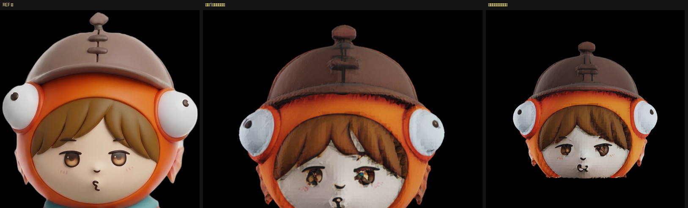

# パーツごとにテクスチャを持たせる（2026-08-30）

[画質の切り分け](2026-08-30-hunyuan-paint.md)で、真因は「顔に割り当てられるテクセルが少ない」
ことだと分かった。全身を 1 枚の 2048 アトラスに詰めるので、顔の取り分が足りない。

**頭を独立させれば、頭だけで 2048 を丸ごと使える。**

## 頭部だけの「形づくり」が失敗したのとは別の話

[以前の実測](2026-08-30-face-quality.md)で、頭部だけを切り出して**形を作らせる**のは失敗した。
4 視点の対応づけができないためで、頭はほぼ球形なのでどの絵がどの向きか決められない。

**塗りは違う。** Hunyuan3D-Paint は「1 枚の絵 ＋ 形」で条件づけるので、視点の対応づけが要らない。
つまり **形は全身のまま作り、出来たメッシュを切って、パーツごとに塗る**ことができる。

## 手順と数字

```
1. 全身のリトポロジー済みメッシュを首の位置で切る（tools/split_parts.py）
     首の高さは「上半分で水平断面の広がりが最小になる高さ」で自動検出
     頭 22,272 面 / 体 19,812 面
2. 絵も首の位置で切って、頭には頭の絵、体には体の絵を渡す
3. それぞれ Hunyuan3D-Paint 2.1 で塗る
     頭 62.5秒 / 体 61.2秒（VRAM いずれも 使用13.39GB・確保20.41GB）
     頭 2048x2048 / 体 2048x2048  ← それぞれ専用
4. 1つの glb にまとめる（材質はパーツごとに分けたまま・tools/combine_parts.py）
```

## 結果



左から 元の絵の頭 / 全身 1 枚のアトラス / **頭だけ専用アトラス**。

**フードのブロック状のノイズが消えた。** 髪と兜も滑らかになった。テクセル密度が上がった効果が
はっきり出ている。

## 踏んだ罠: 上方向の当て推量がパーツで破綻する

glb の上方向を「一番長い軸」で判定していたが、**頭パーツはほぼ球形なので成り立たない**。
Y 上なのに Z 上と誤判定し、頭を下から覗いた絵が出た。

**パーツを扱うなら座標系は推測せず持ち回ること。** 描画側に `UP=y|z` の明示指定を足した。
立ち姿の全身でしか通用しない heuristic だった。

## 残っていること

- 顔はまだ元の絵ほど締まっていない。目が小さく、輪郭が甘い
- パーツの境目（首）の処理をしていない。切り口が開いたまま
- 体のパーツにも同じことをすれば、ベルトや鍵穴がさらに締まるはず
- パーツ数を増やす（顔／髪／フード／兜／服）ほどテクセル密度は上がるが、
  境目と、パーツごとの絵の切り出しが増える
