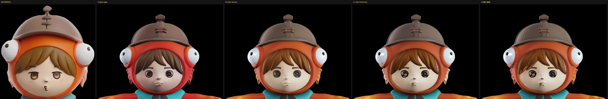
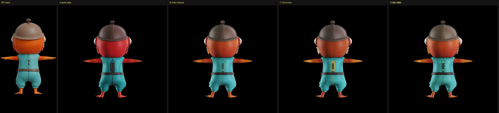
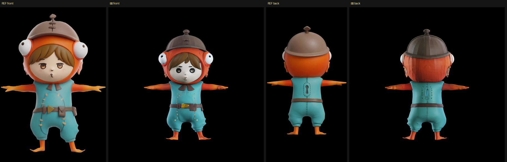
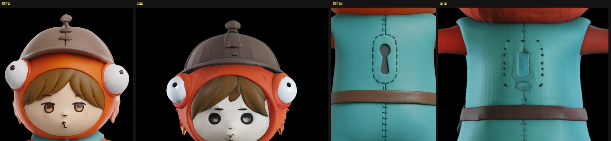
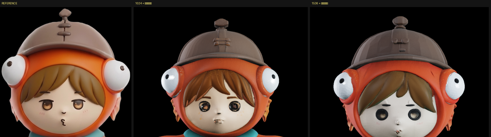

# 視点別に塗って法線で合成した結果（2026-08-30）

[ADR-0006](../adr/0006-texture-per-view-blended-by-normal.md) の方式を実装し、1024 と 1536 の
両方で測った。形は作り直さず `out/shape_1024.ply` / `out/shape_1536.ply` を読んでいる。

## 数字

| | 1024 | 1536 |
|---|---|---|
| ボクセル数 | 3,431,485 | 7,886,896 |
| テクスチャ工程の読み込み | 23s | 24s |
| 形の符号化 | 11s | 38s |
| 塗り（1 視点） | 12〜15s | 41〜44s |
| **塗り工程の合計** | **約 87s** | **約 232s** |
| VRAM / RAM | 5.50 / 13.72 GB | 11.34 / 15.93 GB |
| 法線が引けたボクセル | 85.7% | 68.3% |
| 視点の重み（front/left/right/back） | .250/.244/.237/.269 | .255/.247/.247/.250 |

**重みがほぼ均等になっていることが、法線が壊れていないことの検算になっている。**

法線が引けた割合が 1536 で 68.3% まで落ちるのは、ボクセル格子が頂点の密度より細かくなる
セルが増えるため。残りは中心からの外向きで代用している。**隣接セルまで探せば改善する余地がある。**

## 顔と背中の両立はできた（1024）




| | 顔 | 背中 |
|---|---|---|
| 形とテクスチャ同時（上流のまま） | 暗い穴 | フードが赤すぎる |
| 4 視点で塗り直し | 青灰色の目 | 良い |
| 正面だけで塗り直し | 良い | 黄色が滲む |
| **視点別＋法線合成** | **良い** | **良い** |

## ただし解像度にトレードオフがある





| | 1024＋合成 | 1536＋合成 |
|---|---|---|
| 顔（目・肌の血色） | **良い**（茶色の虹彩＋ハイライト） | **悪い**（暗く落ち窪む・肌が白い） |
| ベルトの黄色い三角バックル | 出ない | **出る**（初めて出た） |
| 背中の鍵穴 | 楕円の輪郭のみ | **破線＋内側の形** |
| 兜のてっぺんの突起 | 2 段 | **3 段**（元の絵と一致） |

**解像度を上げると輪郭レベルの細部は良くなるが、顔は悪くなる。**
彫り込まれた目のくぼみが鋭く解像されるぶん、影が濃くなって不気味さが増す。

## 未解決: 目が彫り込まれる

これが最後まで残った。元の絵の目は**平たく塗られている**が、生成物は**彫り込んでいる**。
テクスチャの塗り直しで「暗い穴」感はかなり減らせたが、形そのものは変わらないので、
解像度を上げると再び悪化する。

**次に試すべきは形の側の手当て。** 案は 2 つ。

1. **顔の領域だけ平滑化してから塗り直す。** 彫られたくぼみをならして、目はテクスチャに任せる。
   工程分離があるので塗り直しは 87 秒で済み、試行は安い
2. **形の guidance_strength を下げる。** 現在 7.5。下げるとモデルが絵の陰影を形として
   彫り込む度合いが減る可能性がある。1 回 3〜11 分なので、こちらのほうが試すのは速い

## 形の生成が異常に遅かった件

`shape_1536.ply` を作る回で **2547 秒**（42 分）かかった。同じ設定を以前測ったときは 688 秒で、
4 倍近い差がある。終了時の RSS が 1.88GB まで縮んでいたので、**メモリ不足でページングが
発生した**と見ている。RAM 31.1GB のうち 22GB を使う処理なので、余裕が小さい。

**測るときは他のプロセスを止めること。** 今日は 2048 の測定でも別プロセスと GPU を取り合って
所要時間を 4 倍に見誤っている。

## 再現方法

```powershell
cd C:\work\parts-studio\TRELLIS.2
$env:ATTN_BACKEND = "xformers"
$env:OPENCV_IO_ENABLE_OPENEXR = "1"
$env:PYTHONIOENCODING = "utf-8"
..\venv\Scripts\python.exe gen_shape.py 1024      # 形を作って out/shape_1024.ply に保存
..\venv\Scripts\python.exe gen_blend.py 1024 4    # 視点別に塗って法線で合成（第2引数は重みの鋭さ）
```
