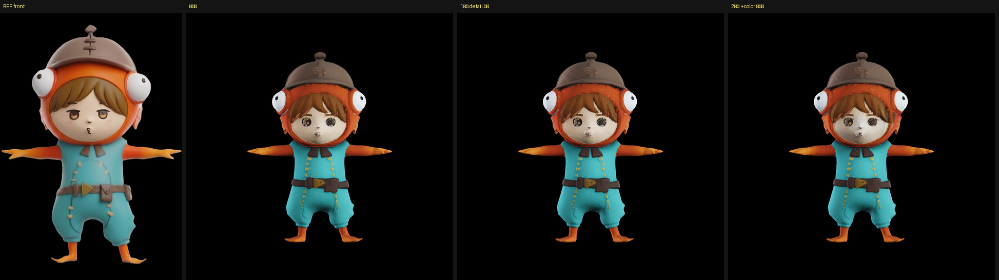
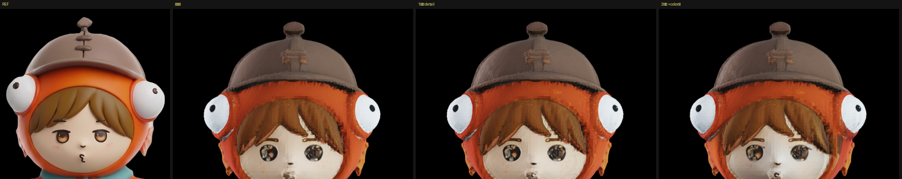

# 元の絵の細部を貼り直す（2026-08-30）

3d-studio の `tools/project_detail.py` を移植した。3d-studio があの顔を出せていた本当の理由で、
[リトポロジーと焼き込み](2026-08-30-retopology-and-bake.md)でまともな UV テクスチャができたことで
初めて前提が揃った。

移植したもの: `project_detail.py` / `project_texture.py` / `silhouette_iou.py` / `image_align.py`。
いずれも **GPU 不要**の純 numpy / trimesh / PIL。呼び出しラッパとして
`tools/apply_reference_detail.py` を書いた（座標系の変換を担当する）。

## 座標系

`project_detail` は **右手系・Y上・正面が +Z** を前提にしている（`silhouette_iou.py:63`）。
こちらの内部は Z上・正面が -Y なので `(x,y,z) -> (x, z, -y)` で渡し、戻す。
**左右どちらの絵がどの向きかは、向こうがシルエット IoU で自動対応づけする**ので指定は要らない。
実際に走らせると `right（90°・left の絵）` と出て、**入力の左右が入れ替わっていることを検出した**
（3d-studio の git ログにも「左右の絵の入れ替わりを発見」とある）。

シルエット IoU は 4 方向とも **0.92〜0.94**。形は絵と合っている。

## ★ V 軸の規約が逆だった（重大）

最初の実行で、`compare_front.png` の「貼る前」——**現在のテクスチャでモデルを描いた画像**——が
**色のパッチが散った状態**になった。シルエットは正しく、内側だけ壊れている。

原因は、こちらが glb を書き出すとき **UV の V 反転を入れていなかった**こと。
`o_voxel.to_glb` の実装には `uvs[:, 1] = 1 - uvs[:, 1]  # Flip UV V-coordinate` があるのに、
自前の焼き込みでそれを写していなかった。

**自前の描画器は同じ規約で読むので正常に見えていた。** つまり
**「自分の描画では正しく、標準の glTF 規約で読む側（Blender・three.js・project_detail）では壊れる」**
glb を作っていた。納品物が glb である以上、これは致命的な取り違えだった。

反転を入れた効果:

| | 採用ブロック | NCC 平均 | 貼れた画素 |
|---|---|---|---|
| 反転なし（誤り） | 289個中 **18個** | 0.40 | 23.03% |
| 反転あり（正しい） | 276個中 **140個** | 0.47 | **41.90%** |

**教訓: 描画器が 2 つあると、規約の食い違いに気づけない。** 標準（glTF）に合わせたほうを正とし、
自前の描画器のほうを直した。

## 結果

3d-studio の手順どおり 2 段構えで当てた。

1. 全身に `--mode=detail`（地の色を守り、模様だけ移す）… 70.5 秒 / 41.90%
2. 顔の帯だけ `--mode=color --top=0.26 --bottom=0.48`（色ごと貼る）… 42.4 秒 / 13.13%



**胴体は明確に良くなった。**

- **ベルトのバックルが黄色い三角になった**（貼る前は茶色の塊）
- 服の縫い目が出た
- 胸元の黄色い粒がはっきりした

## 顔は直らなかった



**目は暗い染みのままで、元の絵の茶色い虹彩＋ハイライトにならない。** 2 段目の
`--mode=color` を顔の帯に当てても変わらなかった（採用ブロックが 86個中 17個と少ない）。

理由は今日ずっと追ってきたものと同じで、**目が幾何として彫り込まれている**こと。
彫られた窪みに元の絵を貼っても、その窪みの陰影が勝つ。3d-studio の形（Hunyuan3D）は
顔が平らなので貼るだけで戻ったが、TRELLIS.2 の形は平らではない。

**元絵の投影は「平らな面に描かれた模様」を戻す道具であって、彫られた形は戻せない。**

## 再現方法

```powershell
cd C:\work\parts-studio
# 1段目: 全身の模様
.\venv\Scripts\python.exe tools\apply_reference_detail.py out\own_flipv.glb out\detail_d1.glb `
  --front=testimg\front.png --left=testimg\left.png --right=testimg\right.png --back=testimg\back.png `
  --mode=detail --dump=out\dump_d1
# 2段目: 顔だけ色ごと
.\venv\Scripts\python.exe tools\apply_reference_detail.py out\detail_d1.glb out\detail_d2.glb `
  --front=testimg\front.png --left=testimg\left.png --right=testimg\right.png --back=testimg\back.png `
  --mode=color --top=0.26 --bottom=0.48 --dump=out\dump_d2
```

`--dump` の `compare_<向き>.png`（元絵 / 貼る前 / 貼った後 の3段）を必ず見ること。
**「貼る前」が壊れていたら、それは UV の規約の取り違え**である。
