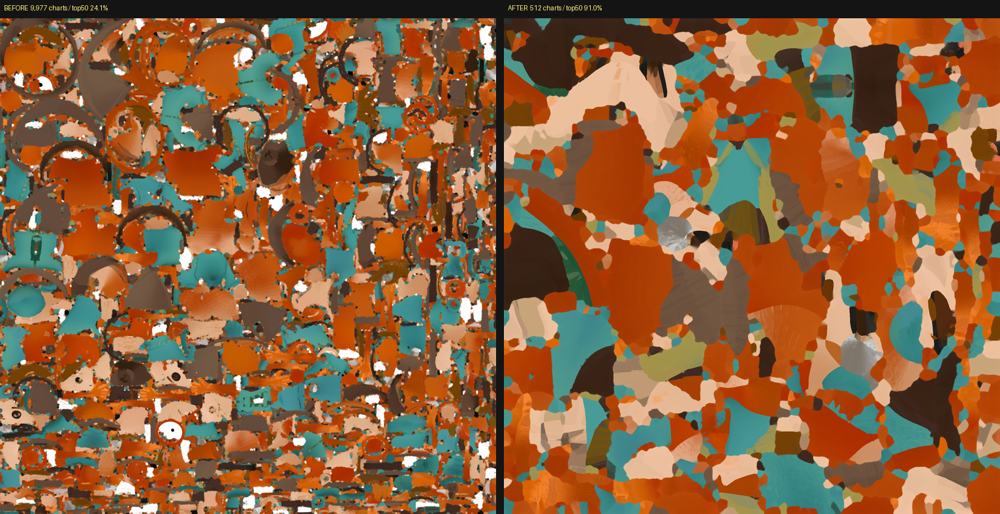
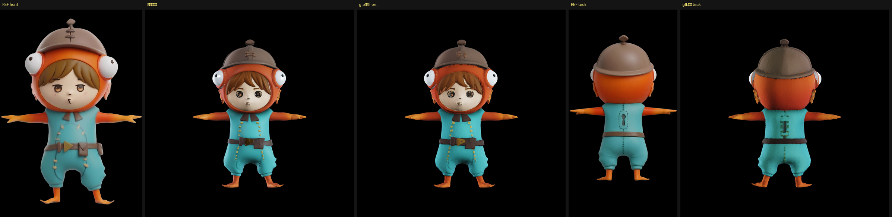

# リトポロジーを入れて UV を作り直す（2026-08-30）

[UV の測定](2026-08-30-uv-unwrapping.md)で、書き出した glb が 9,977 チャート・中央値 1 面という
状態だと分かった。ADR-0007 のとおりリトポロジーを入れて、焼き込みまで通した。

## 結果

| | 面数 | charts | 上位50で | 利用率 |
|---|---|---|---|---|
| 素の TRELLIS.2 出力 | 289,493 | 9,977 | 24.1% | 56.0% |
| 面数を 2 万に削っただけ | 18,768 | 1,150 | 39.8% | 59.9% |
| **リトポロジー＋xatlas＋自前焼き込み** | **42,084** | **512** | **91.0%** | **56.5%** |
| （参考）3d-studio の実際の出力 | 60,000 | 231 | 79.5% | 57.7% |



所要は リトポロジー 約30秒 ＋ UV展開 6秒 ＋ 焼き込み 10秒。

## 通った手順

1. TRELLIS.2 で形とボクセル色を作る（多視点条件付け・ADR-0005、視点別合成・ADR-0006）
2. `to_glb` で作業用メッシュを得る（6 万面）
3. **Blender でボクセルリメッシュ → 元の表面へシュリンクラップ**（`tools/retopo_shrinkwrap.py`）
4. **xatlas で展開**（`tools/bake_to_uv.py` の `unwrap`）
5. **自前で焼き込み**（`tools/bake_to_uv.py` の `bake`）

## 途中で分かったこと

### QuadriFlow は使えなかった

3d-studio の `remesh_blender.py` をそのまま当てたら、QuadriFlow が
「多様体でなく、面法線の向きも揃っていない」と言って拒否した。掃除しても
**おかしな辺が 720 本**残る（元は 30,365 本）。

ボクセルリメッシュを前に入れると解決した。しかも**ボクセルリメッシュ自体が四角 100% を出す**ので、
QuadriFlow は不要だった。

| ボクセル幅 | 面 | 四角 | おかしな辺 | つながり |
|---|---|---|---|---|
| 0.009 | 21,042 | **100%** | **0 本** | **1 個** |
| 0.006 | 47,648 | 100% | 0 本 | **2 個** |

幅 0.006 では分離が 2 個になり、これが QuadriFlow が拒否したもう 1 つの理由だった。

### 貼り付け直し（シュリンクラップ）が要る

ボクセルリメッシュは表面を最大 0.0045 ずらす。色のボクセル場は幅 1/1024 ≒ 0.00098 なので、
**4〜5 ボクセル分外した位置を引く**ことになる。元の表面へスナップして戻す。

### `to_glb` に外部メッシュを渡すと壊れる

`to_glb` は焼き込みのとき、テクセルの 3D 位置を **BVH で引数の `vertices`/`faces` へ射影し直して
から**ボクセル場を引く（コードのコメント「This corrects geometric errors introduced by
simplification/remeshing」）。つまり **`vertices`/`faces` は「ボクセル表面に乗った元メッシュ」で
なければならず、出力トポロジーは内部で作る前提の API**。

リトポロジー済みメッシュを渡すと射影先ごとずれるので、**アトラスがほぼ真っ黒**（色が乗った画素 2.3%）
になった。そこで焼き込みを自前で書いた（`tools/bake_to_uv.py`）。役割を分けるだけでよい。

- BVH と射影の相手 = 元のメッシュ
- 出力トポロジーと UV = こちらで用意したもの

手順自体は `to_glb` と同じ（UV 空間でラスタライズ → 位置を補正 → 三線形補間 → 継ぎ目を inpaint）。

### `remesh_project=0.9` はチャートを悪化させる

既定は 0.9（リメッシュ後の頂点を元の表面へ戻す）だが、チャート数が 2,691 → 8,626 と悪化した。
`to_glb` 内で完結させる場合は 0 のほうがよい。

### xatlas は「きれいなメッシュ」でだけ強い

汚いメッシュでは cumesh に負ける（6 万面で 4,142 対 2,777）。リトポロジー後は逆転して
512 チャートまで下がった。**展開器の優劣ではなく、入力の質で決まる。**

## まだ確かめていないこと

- **焼けたテクスチャを貼った状態の見た目。** `MeshWithPbrMaterial` での描画がネイティブ側で
  落ちるままで、glb の実物を目で見ていない
- この UV で `project_detail.py`（元絵の投影）が通るか

## 再現方法

```powershell
cd C:\work\parts-studio
.\venv-bpy\Scripts\python.exe tools\retopo_shrinkwrap.py out\uv_C_60k.glb out\vox_snap_0.009.glb 0.009
cd TRELLIS.2
..\venv\Scripts\python.exe gen_own.py 1024 4     # 塗り→UV展開→自前焼き込み→own_baked.glb
```

---

## 追記: 視点そろえの UV は失敗した（2026-08-30）

「入力が 4 方向の絵なのだから、面を一番よく見える視点へ平面投影すればチャートは 4 枚で済み、
アトラスが元の絵と 1 対 1 で対応するのではないか」と考えて実装した（`tools/bake_to_uv.py` の
`unwrap_view_aligned`）。**xatlas に負けた。**

| | charts | 上位50で | 利用率 | 色が乗った画素 |
|---|---|---|---|---|
| xatlas（リトポ後） | **512** | **91.0%** | **56.5%** | 56.5% |
| 視点そろえ | 1,643 | 85.9% | 16.7% | 14.8% |

理由は 3 つ。

1. **面ごとに最良の視点を選ぶと、割り当てが散る。** 「正面向き」の面は胴体・腕・脚・フードに
   飛び飛びで存在するので、視点 1 つにつき 1 枚の島にはならない
2. **4 方向では覆いきれない。** 42,084 面のうち **10,017 面（24%）** がどの視点からも斜めで、
   xatlas 送りになった
3. **詰め込みが下手。** キャラのシルエットは矩形の 4 割程度しか埋めないので、利用率が 16.7% に落ちた

（実装の途中で、面ごとに頂点を複製して 32,510 チャートになる不具合も踏んだ。視点グループ内で
頂点を溶接して 1,643 まで下がったが、それでも xatlas に及ばない）

### 動機そのものが弱かった

「視点そろえにすれば元絵の投影で位置合わせが要らなくなる」と考えたが、**誤りだった**。
3d-studio の `project_detail.py` は**画面空間で動く** — モデルを各方向から描画し、元絵と
ブロック単位で照合して、当たった画素をテクセルへ書き戻す。**UV の並びが何であっても動く。**

やるとすれば「面ごとの argmax」ではなく「視点ごとに連結領域を育てる」実装が要るが、
上の理由 2（24% が覆えない）は消えないので、投資に見合わない。**xatlas ＋ リトポロジーを採る。**

---

## 追記: 書き出した glb の実物を確認した（2026-08-30）

数値だけで「良くなった」と言っていたので、`MeshWithPbrMaterial` での描画を直して実物を見た。



左から 元の絵(正面) / ボクセル場の描画 / **glb実物(正面)** / 元の絵(背面) / **glb実物(背面)**。

**42,084 面の glb が、340 万面のボクセル場の描画とほぼ同じ見た目になっている。**
面数を 80 分の 1 にしても、細部はテクスチャが持っている。背中の鍵穴・中央の縫い目・
ベルトのバックルも残っている。

最終的な数字:

```
リトポロジー済み  頂点 21,044 / 面 42,084（四角100%・多様体・つながり1個）
UV展開(xatlas)    535 charts / 上位50で 90.9% / 利用率 55.8%
焼き込み          色が乗ったテクセル 55.8%（利用率と一致）
```

### 踏んだ罠: 上方向は書き出し経路で変わる

trimesh で glTF を読むと **Y-up のことと Z-up のことがある**。

| ファイル | 経路 | 読み込み時の上方向 |
|---|---|---|
| `uv_C_60k.glb` | `o_voxel.to_glb` → trimesh | **Y-up** |
| `vox_snap_0.009.glb` | Blender の glTF 書き出し | **Y-up** |
| `own_baked_xatlas.glb` | trimesh に直接 export | **Z-up** |

内部の描画と焼き込みは Z-up。ここを決め打ちしたせいで 2 つ壊した。

1. **焼き込みで座標系がずれていた。** BVH の射影先（元メッシュ・Z-up）とリトポロジー済み
   メッシュ（Y-up）が 90 度ずれた状態で焼いていた。チャート数などの UV の数値は座標系に
   依存しないので有効だったが、**焼けた色は誤りだった**
2. **描画で 90 度倒れた。** 直したつもりで今度は二重に変換して、また倒れた

**決め打ちをやめ、一番長い軸を見て判定するようにした**（立ち姿のキャラ前提）。
`tools/` に置くときは、この判定を関数に切り出すこと。
