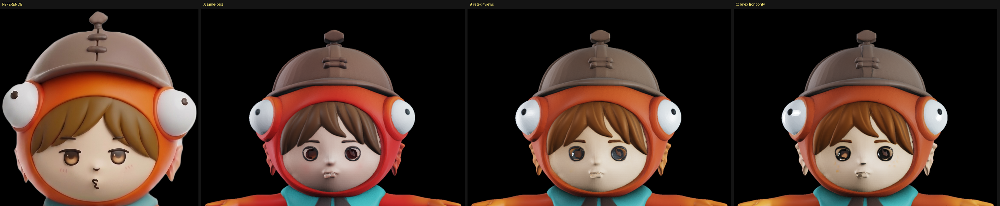
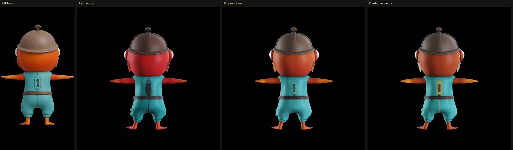

# 形とテクスチャを分けて塗り直す（2026-08-30）

[顔の品質の切り分け](2026-08-30-face-quality.md)で「目が彫り込まれる」問題が残った。
ADR-0002 で決めた工程分離を実際に使い、**形は据え置きでテクスチャだけ塗り直す**と何が変わるかを見る。

## 分離は成立した（そして安い）

| | 所要 | VRAM | RAM |
|---|---|---|---|
| 形の生成（4視点・multidiffusion・1024） | 193s | 4.89 GB | 21.48 GB |
| テクスチャ工程の読み込み | 22〜25s | — | — |
| 塗り直し（4視点） | 63s | 5.30 GB | 12.69 GB |
| 塗り直し（正面のみ） | **27s** | 5.20 GB | 12.73 GB |

**塗り直しは形の生成の 1/3〜1/7 の時間で済み、必要 RAM も 12.7GB と大幅に軽い**
（`Trellis2TexturingPipeline` は 4 モデルしか読まないため）。
ADR-0002 の「Unwrapped Shape を第一級の保存物にして何度でも塗り直す」は、実測で見合う。

### 踏んだ罠: 軸の入れ替え

`Trellis2TexturingPipeline.preprocess_mesh` は `(x,y,z) -> (x,-z,y)` の軸入れ替えをする。
外から来た一般的なメッシュを内部座標系へ直すための処理だが、**こちらの形は既に内部座標系**なので
余計な 90 度回転がかかり、形が寝た状態で条件の絵は立っている、という噛み合わない状態になった。
逆変換 `(x,y,z) -> (x,z,-y)` を先に当てて打ち消す。

## 塗り直しは顔を変える

| | 目 |
|---|---|
| REFERENCE | 茶色の虹彩＋白いハイライト。平たい塗り |
| A: 形とテクスチャを同時に作る | **暗い穴**。虹彩が沈む |
| B: 4 視点で塗り直し | 虹彩とハイライトが出た。ただし**青灰色**で色が違う |
| C: **正面だけで塗り直し** | **茶色の虹彩＋ハイライト。最も元の絵に近い** |

彫り込まれた形自体は変わらないが、**塗りが変わるだけで「暗い穴」感はかなり減る**。

## ただし背中が犠牲になる

| | 背中 |
|---|---|
| REFERENCE | フードはオレンジ、水色の服、鍵穴の輪郭 |
| A: 同時 | フードが赤すぎる。鍵穴が暗い金具 |
| B: **4 視点で塗り直し** | **最良**。フードがオレンジ、鍵穴の輪郭も出る |
| C: 正面だけ | フードが赤茶、**正面の黄色が背中と脚に滲む** |

## 結論

**顔と背中は、要求する条件が正反対。**

- 顔は正面からしか見えない → 正面だけで塗るのが最良
- 背中は背面からしか見えない → 4 視点で塗るのが最良
- 1 つの条件で全面を塗る限り、どちらかが必ず犠牲になる

答えは**面ごとに「その面が見えている視点」で塗り分けること**。塗り直しが 27〜63 秒と安いので、
**視点別に複数回塗って、面の法線（またはその視点からの可視性）で混ぜる**のが現実的な実装になる。

## 次にやること

1. 視点別に 4 回塗り、法線で重みづけして混ぜる工程を書く
2. 混ぜ目が見えないよう、視点間の重みをなめらかにする
3. 形は 1536 で作る（[前回の実測](2026-08-30-face-quality.md)で 1024 より明確に良い）

## 再現方法

`TRELLIS.2/gen_retex.py`（pass A+B）、`gen_retex_b.py`（pass B のみ・軸修正入り）、
`gen_retex_c.py`（`RETEX_MODE=front|md` で切り替え）。いずれも git 管理外。
形は `out/shape_1024.ply` に保存済みで、pass B だけを何度でも回せる。
