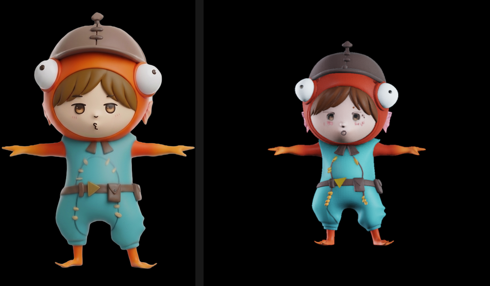
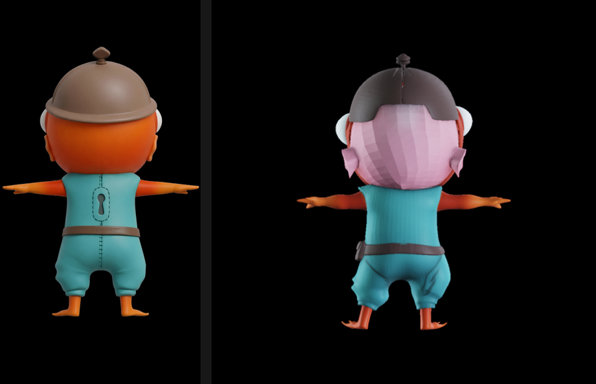
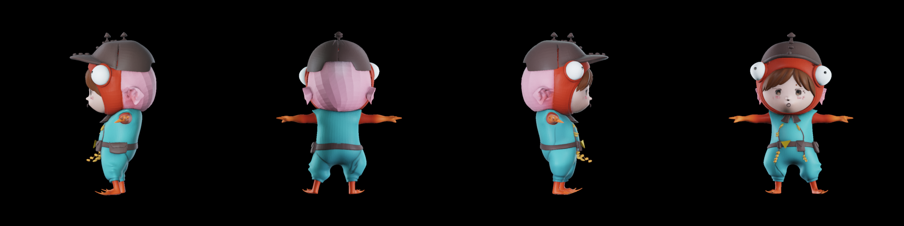

# 実物の絵から初めて glb を作った（2026-08-30）

DINOv3 の承認が下りたので、[メモリ実測](2026-08-30-trellis2-memory.md)で代役に立てていた
DINOv2-large を本物に戻し、**実際の題材**（3d-studio と同じ、魚のフードをかぶったチビキャラ）の
**正面 1 枚**から生成した。

## 条件

| | |
|---|---|
| 入力 | `08c871a36be2_cut_front.png`（1376x2012・RGBA・切り抜き済み） |
| 経路 | `1024_cascade`（既定） / seed 1234 |
| 背景ぬき | **呼ばれていない**（透過 PNG なのでダミーを差した。RMBG-2.0 不要を実証） |
| 描画 | `studio.exr` 環境光・512px・4 方向 |

## 数字

```
load    55s   RAM 18.37 GB
run     99s   頂点 3,703,476 / 面 7,593,488   VRAM ピーク 5.03 GB / RAM 21.75 GB
render   5s
glb     19s   decimation_target=300000 / texture_size=2048
合計   約3分  VRAM ピーク 5.03 GB / RAM ピーク 22.04 GB
```

代役（DINOv2）のときは頂点 195,698 だった。**本物の条件付けで約 19 倍**になっている。
条件が正しいほど密な構造が出る、ということ。VRAM は 2.9GB → 5.03GB に増えたが、まだ 16GB に
遠く及ばない。**RAM は 22.04GB でほぼ変わらず**、こちらが制約であることも変わらない。

## 見た目

### 正面 — 非常に良い



（左が元の絵、右が生成）

兜の突起、オレンジの魚フード、左右の目玉、前髪、目のハイライト、頬の赤み、胸元のひもと
黄色い粒、ベルトの三角バックルと横のポーチ、ヒレ状の手と足 — **元の絵の特徴がほぼ全部、
形として出ている**。

外れているのは、兜の頂点の突起の作り（元は3段の縫い目状、生成は輪が2つ）と、全体が
わずかに縦に潰れていること。

### 後ろ — 外れている



（左が元の絵の後ろ、右が生成の後ろ。**元の絵の後ろは条件として渡していない**）

| 元の絵 | 生成 |
|---|---|
| フードは**オレンジ** | **ピンクの縞模様** |
| 兜は丸いドーム | ひさし付きの扁平な帽子 |
| 背中に**鍵穴**がある | 無い |
| 中央に**縫い目**がある | 無い |
| — | 正面の目玉が横から回り込んで見えている |

体の水色と腕のヒレは合っている。

### 4方向



（左から順に yaw = π/2, 0, -π/2, π。右端が正面、左から2番目が後ろ）

## 結論

**ADR-0003 で予測した失敗が、そのまま出た。**

TRELLIS.2 の造形力そのものは高い。正面から見える範囲は、3d-studio で Hunyuan3D-2.0 mv が
4 枚使って出していた水準に、**1 枚だけで届いている**。

一方で後ろは想像であり、その想像は元の絵から大きく外れる。3d-studio で Hunyuan3D-2.1 が
「元の絵は頭巾なのに後頭部に髪を作った」のと同じ種類の失敗で、モデルを変えても消えていない。

したがって **ADR-0003 の「(D) 多視点の条件付けを後段で足す」は、あれば良いものではなく必須**である。
<!-- 注記（2026-08-31）: この時点の話。いまは 4 View すべてが Reference View で、
     Check View は存在しない（ADR-0005 / CONTEXT.md）。 -->
Q4 で「4 枚必須」と決めた判断は正しかったが、いまはその 4 枚のうち 3 枚が Check View
（答え合わせ）にしか使えていない。**次の課題は、残り 3 枚を Reference View に昇格させること。**

## 途中で踏んだもの

| 症状 | 原因と対処 |
|---|---|
| `cv2.error: !_src.empty()` で HDRI が読めない | `opencv-python-headless` 5.0.0 は EXR 非対応。`<5`（4.14.0）に下げると `OPENCV_IO_ENABLE_OPENEXR=1` で読める |
| `'DINOv3ViTModel' object has no attribute 'layer'` | transformers 5.16.1 で層が `model.model.layer` へ移った。上流 `extract_features` は `self.model.layer` を直接舐めている。**内部属性に触らず**、`output_hidden_states=True` の `hidden_states[-1]`（最終層出力・norm 前）を使えば同じものが取れる（実測で確認） |

## 再現方法

`TRELLIS.2/gen.py`（git 管理外）:

```powershell
cd C:\work\parts-studio\TRELLIS.2
$env:ATTN_BACKEND = "xformers"
$env:OPENCV_IO_ENABLE_OPENEXR = "1"
$env:PYTHONIOENCODING = "utf-8"
..\venv\Scripts\python.exe gen.py front 1024_cascade
```
