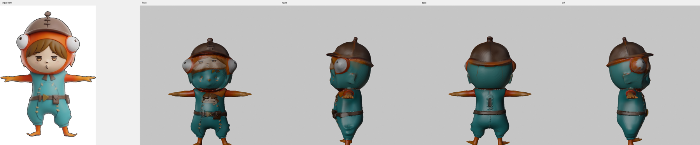

# 4枚の絵から完成した glb までを1コマンドで通した（2026-08-31）

[#5](https://github.com/na2-dev/parts-studio/issues/5) で `tools/run_pipeline.py` を作り、
手で繋いでいた工程を1コマンドにした。RTX 4070 Ti SUPER 16GB。

```powershell
.\venv\Scripts\python.exe tools\run_pipeline.py `
  --front=testimg\front.png --left=testimg\left.png `
  --right=testimg\right.png --back=testimg\back.png `
  --out=out\model.glb
```

## 実測

| 工程 | 中身 | 時間 |
| :--- | :--- | ---: |
| 1. 形を作る | TRELLIS.2 + 多視点（`multidiffusion` / 1024） | **109s** |
| 2. リトポロジー | Blender ボクセル化 → 元表面へスナップ | 約 15s |
| 3〜7. パーツづくり | 切る → ならす → 塗る ×2 → 投影 ×2 → 結合 | **192s** |
| | 　うち 頭を塗る | 59.6s |
| | 　うち 頭に投影（45.06%） | 約 25s |
| | 　うち 体を塗る | 46.4s |
| | 　うち 体に投影（32.39%） | 約 20s |
| **合計** | | **約 320 秒（5分20秒）** |

出来上がりは 42,088 面、頭と体がそれぞれ 2048×2048 のテクスチャを持ち、
glTF の向き（Y 上）で立って表示される。



## 3つの Python 環境をまたぐ

| 環境 | Python | 何に使うか |
| :--- | :--- | :--- |
| `venv` | 3.11 | 形づくり（torch 2.7.0+cu128）と `run_pipeline` 自身 |
| `venv-bpy` | 3.11 | リトポロジー（bpy は 3.11 用しか無い） |
| `venv-21` | 3.12 | 色塗り（torch 2.6.0+cu126） |

同居できないので、リトポロジーと色塗りは**別プロセスとして呼ぶ**。
`run_pipeline` は形づくりと同じ環境で動き、下の2つを起動する。

## 踏んだ罠: リトポロジーは成功しても終了コードが 0 にならない

**bpy をモジュールとして使うと、書き出しを終えたあとインタプリタの終了時に落ちる。**

```
保存: C:\work\parts-studio\out\pipe\retopo.glb      ← 書けている
リトポロジーに失敗しました（終了コード 3221225477）  ← それでも異常終了
```

`3221225477` = `0xC0000005` = ACCESS_VIOLATION。**glb は正しく書けている。**

終了コードだけで判定していたので、正しく出来た形を捨てて止まっていた。

**直しかた**: 出力の更新時刻を実行の前後で比べ、**新しくなったか**で判定する。
終了コードが 0 でなかったことは**黙って飲み込まず、必ず表示する**。

```
※ リトポロジーは出力を書きましたが、終了コードが 3221225477 でした
   （bpy が終了時に落ちる既知の挙動）。出力を使って続けます。
```

「ファイルがあるか」ではなく「**新しくなったか**」で見るのが要点で、
そうしないと前回の形をそのまま使ってしまう。

## 途中から始められる

形づくりに約2分、塗りに約1分半かかるので、`--from` で工程を選べる。

| `--from` | 走る工程 | 前もって要るもの |
| :--- | :--- | :--- |
| `shape`（既定） | 全部 | 絵だけ |
| `retopo` | リトポロジー以降 | `<work>/shape.glb` |
| `parts` | パーツづくりだけ | `<work>/retopo.glb` |

**要るのは「始める工程が食べるもの」だけ**にしてある。
`--from=parts` のときに形（`shape.glb`）まで要求すると、
リトポロジー済みの形があるのに始められない（実装中に一度そうなっていた）。

## 上方向はここで決めて配る

形づくりの出力は Z 上。**パーツからは測れない**ので、
`run_pipeline` が `SHAPE_UP = 'z'` を下の工程へ配る。
出来上がりは結合のところで glTF の Y 上に直る。
経緯は [2026-08-31-up-axis.md](2026-08-31-up-axis.md)。

## 残っていること

- 貼れた画素は [08-30 の記録](2026-08-30-final-pipeline.md#1-パーツ単独での投影解消)
  （頭 50.06% / 体 38.16%）を下回ったままである
- 別の題材で通していない（[#6](https://github.com/na2-dev/parts-studio/issues/6)）
- 顔の細部（目・口）は入力の絵に比べてまだ薄い
