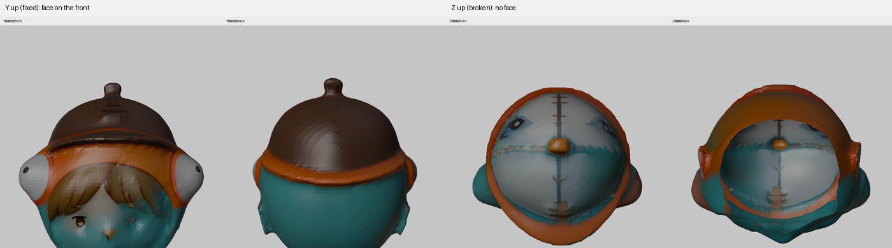
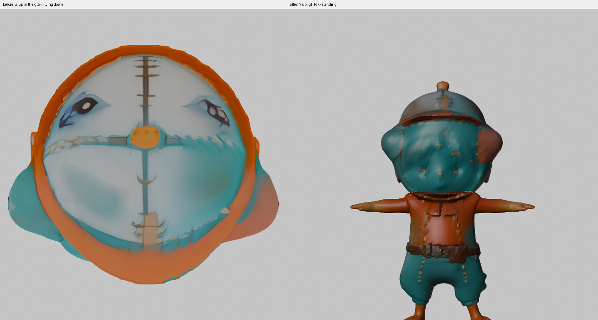

# 上方向を3か所で間違えていた（2026-08-31）

パーツ工程を1コマンドにまとめる（[#4](https://github.com/na2-dev/parts-studio/issues/4)）
作業中に、**上方向の扱いが3か所で間違っていた**ことが分かった。
どれもエラーを出さず、出来上がりが静かに悪くなるだけだった。

このパイプラインの中身は **Z 上・正面が -Y**（TRELLIS.2 の向きをそのまま持ち回っている）。

> **前の記録との関係。**
> [2026-08-30 の記録](2026-08-30-part-textures.md#踏んだ罠-上方向の当て推量がパーツで破綻する)
> でも同じ罠を踏んでおり、そこでは「**Y 上なのに Z 上と誤判定**」と書いてある。
> 今回は逆向き（Z 上なのに Y 上と誤判定）だが、**矛盾ではない。**
> [同じ日の別の記録](2026-08-30-retopology-and-bake.md#踏んだ罠-上方向は書き出し経路で変わる)
> のとおり、**中身の向きは書き出し経路で変わる**（`to_glb` 経由なら Y 上、
> trimesh に直接 export なら Z 上）。あちらは `to_glb` 経由のパーツ、
> こちらは trimesh 直の連鎖なので、誤判定の向きが反対になる。
>
> **つまり「一番長い軸で当てる」こと自体が誤りで、向きは推測せず持ち回るのが正しい。**
> 08-30 は描画側に `UP=y|z` を足したが、投影・切る・塗る・結合には入っていなかった。

| # | どこ | 間違い | 症状 |
| ---: | :--- | :--- | :--- |
| 1 | 元絵の投影 | パーツの上方向を「一番長い軸」で測っていた | 貼れた画素が 1/4 に |
| 2 | 色塗り | Z 上のまま上流へ渡していた | **顔が頭の裏側に付く** |
| 3 | 結合 | Z 上のまま glb に書いていた | 標準のビューアで**寝て表示される** |

**2 の直しは [A-4 の PR（#20）](https://github.com/na2-dev/parts-studio/pull/20) に入っている**
（`tools/paint_backend.py` はそちらのブランチのファイル）。A-5 の差分には含まれない。

## 1. パーツの上方向は測れない

`apply_reference_detail.load_mesh_as_yup` は「一番長い軸が上」として判定していた。
全身なら当たるが、**パーツでは当たらない。**

| メッシュ | X | Y | Z | 一番長い軸 | 実際 |
| :--- | ---: | ---: | ---: | :--- | :--- |
| `shape_retopo.glb`（全身） | 0.758 | 0.433 | **0.999** | Z ✅ | Z 上 |
| `head_raw.glb`（切っただけ） | **0.488** | 0.433 | 0.470 | X ❌ | Z 上 |
| `head_shape.glb` / `head_painted.glb`（ならした後） | **0.485** | 0.428 | 0.459 | X ❌ | Z 上 |
| `body_raw.glb` / `body_painted.glb` | **0.758** | 0.287 | 0.536 | X ❌ | Z 上 |

（`head_raw` と `head_shape` で値が違うのは、間にならしが入るため。
コードとテストが引いているのは `head_raw` の値。）

パーツは「Y 上」と誤判定され、変換されない。一方 `--partof` で渡す全身は
正しく Y 上へ変換されるので、**パーツと基準の座標系がずれる。**

このとき、体の視点の自動対応づけも壊れていた。

```
front（  0°）← back  の絵 / 一致 0.254   ★名前と違います
back （180°）← front の絵 / 一致 0.239   ★名前と違います
```

**直しかた**: パーツは切り出し元の上方向を引き継ぐ。`make_parts` が全身で測って
全パーツへ渡す（`--up` で明示もできる）。

| | 前 | 後 |
| :--- | ---: | ---: |
| 頭・貼れた画素 | 9.46% | **37.37%** |
| 体・貼れた画素 | 6.18% | **33.49%** |

直したあと、体の自動対応づけは**固定マッピングと完全に一致**した。

```
front（  0°）← front の絵 / 一致 0.432
right（ 90°）← left  の絵 / 一致 0.401
back （180°）← back  の絵 / 一致 0.469
left （270°）← right の絵 / 一致 0.407
```

**★ここは断定できない。** `front→front / right→left / back→back / left→right`
という並びが座標の規約から導けるかは確かめていない。
`project_detail.assign_views` の記録はむしろ逆で、左右の入れ替わりを
**「このデータでは入れ替わっていました」＝データ固有の性質**として書いている。

それでも `make_parts` は**既定で固定**にする。自動割り当てが外すのを実測しており
（頭で正面を後ろに割り当てた）、この題材では固定と自動が一致したため。
**`--no-fixviews` で外せる。**

**代償を書いておく。** `--partof` を渡すと `fixfit=True` が立ち、
`project_detail` の「一致が `minshape` 未満なら使わない」関門も外れる。
固定と合わせると、**絵とメッシュが噛み合っているかを見る仕組みが2つとも切れる。**
別の題材を通すとき（[#6](https://github.com/na2-dev/parts-studio/issues/6)）は
`--no-fixviews` で自動割り当ての言い分を必ず見ること。

なお固定が効くのは `make_parts` 経由のときで、
`apply_reference_detail.py` を直接叩いた場合の既定は自動割り当てのまま
（`--fixviews` でオプトイン）。

## 2. 色塗りは Y 上のメッシュを前提にしている

**これが一番重い。** Z 上のまま Hunyuan3D-Paint へ渡すと、**顔が頭の裏側に付く。**

同じ頭（`head_shape.glb`）を、Z 上のままと Y 上に直したもので塗り分けて描画した。

| 渡した向き | 結果 |
| :--- | :--- |
| Z 上（それまで） | 顔が無い。十字の筋が入った模様になる |
| **Y 上** | **兜・オレンジのフード・白い目・前髪・顔が正しい側に出る** |



胴体は輪郭から前後が分かるので、間違えていても「なんとなく塗れている」ように見える。
**球に近い頭だけが壊れる**ので気づきにくい。

**直しかた**: `paint_backend` が `--up=z`（既定）なら、渡す前に Y 上へ直し、
返ってきたものを Z 上へ戻す。

頭に元絵を投影したときの貼れた画素も上がった（塗りが正しくなり、ブロックが
合うようになったため）。

| | 直す前 | 直した後 |
| :--- | ---: | ---: |
| 頭・貼れた画素 | 37.37% | **45.06%** |
| 体・貼れた画素 | 33.49% | 32.39% |

## 3. 出来上がりが glTF の規約に違反していた

**glTF は「+Y が上、+Z が正面」と決まっている**
（[仕様 §3.4 Coordinate System and Units](https://registry.khronos.org/glTF/specs/2.0/glTF-2.0.html#coordinate-system-and-units)
「glTF defines +Y as up, +Z as forward, and -X as right; the front of a glTF asset faces +Z」）。
しかしこのパイプラインの出力は Z 上のまま書かれていた。
標準のビューアで開くと**寝て表示される**。

内部の規約は「Z 上・正面が -Y」なので、`(x,y,z) -> (x,z,-y)` は上方向だけでなく
**正面（-Y → +Z）も同時に規約へ合わせている**。



生の glb（JSON の塊とアクセサの min/max）を読んで確かめた。

```
shape_retopo.glb   X=0.758 Y=0.433 Z=0.999  -> 一番長い軸=Z
```

trimesh は **glb へ頂点をそのまま書き、ノード変換を持たせない**（実測）。
つまり Z 上のメッシュを渡せば Z 上の glb ができる。Blender で読み書きしても
importer と exporter の変換が打ち消し合うので、中身は Z 上のまま残る。

**直しかた**: `combine_parts` が最後に Y 上へ直す。途中のファイルは Z 上のままに
してある（工程どうしの受け渡しは内部の話なので、規約に合わせるのは人が開く
最後の1つだけでよい）。

**`Scene.apply_transform` では直らない。** 実測（2026-08-31）で、
`scene.apply_transform(M)` してから `scene.export(glb)` すると、
書き出した glb の `POSITION` アクセサは**回す前の値のまま**だった
（ノード変換も付かない）。各メッシュの頂点に焼き込む必要がある。

### テストを間違えかけた

最初、直った glb を `trimesh.load` で読み直して検証していた。**これは通らない。**
trimesh は自分が書いたものをそのまま読むだけなので、規約に合っているかを検証できない。
実際にこれで一度、直っていないのに緑になった。

いまは**生の glb の JSON を読んで**、`POSITION` アクセサの min/max と、
ノード変換が付いていないことを見ている。

## おまけ: ならすと首の切り口が動いていた

上方向とは別だが、同じ日に見つけたので書いておく。

頭だけをならすと、**首の切り口が動く**（ラプラシアン平滑化は開いた縁を固定しない）。
体はならさないので、**そのままだと頭と体の切り口が合わなくなる。**

| | z | 中心 | 平均半径 |
| :--- | ---: | :--- | ---: |
| 頭・ならす前 | 0.02909 | (-0.019, -0.013) | 0.12604 |
| 頭・ならした後（固定なし） | **0.03712** | **(-0.015, +0.026)** | **0.12215** |
| 体の上端 | 0.03642 | (-0.017, -0.001) | 0.12736 |

ならした頭の下端 0.03712 が体の上端 0.03642 を**上回っていた**（隙間ができる）。
`volume_constraint` の有無ではほとんど変わらなかった（0.00803 と 0.00785）。

**直しかた**: 開いた縁（1つの面にしか属さない辺）の頂点を、ならした後に
元の位置へ戻す。直したあとは切り口が**完全に一致**する。

```
頭（切っただけ）: z=0.02909 中心=(-0.01875,-0.01315) 半径=0.12604
頭（ならした後）: z=0.02909 中心=(-0.01875,-0.01315) 半径=0.12604
```

## 通しの結果（2026-08-31・RTX 4070 Ti SUPER 16GB）

```
python tools\make_parts.py --shape=out\shape_retopo.glb --out=out\final.glb ^
    --front=... --left=... --right=... --back=...
```

| 工程 | 時間 |
| :--- | ---: |
| 首で切る | 数秒 |
| 頭をならす（切り口は固定・体はならさない） | 数秒 |
| 頭を塗る | 47.9s |
| 頭に元絵を投影（45.06%） | 24.8s |
| 体を塗る | 46.5s |
| 体に元絵を投影（32.39%） | 19.9s |
| 結合（glTF の向きへ） | 数秒 |
| **合計** | **156 秒** |

出来上がりを4方向から描画して、入力の絵と見比べた。
**兜・オレンジのフード・白い目・前髪・顔が front に、背中の鍵穴が back に出ている。**
立った姿勢で表示される。


## 数値の出どころ

上の表は、この日 Windows 機で走らせた `tools/make_parts.py` の**標準出力から
書き写したもの**である。ログそのものはリポジトリに入れていない
（`out/` と `*.glb` は `.gitignore` の対象）。再現するには同じコマンドを
同じ機体で走らせる必要がある。判定に使った描画は `images/` に入れてある。

## ★前の記録より下がっている

[2026-08-30 の実測](2026-08-30-final-pipeline.md#1-パーツ単独での投影解消)は
`--partof` 経路で **頭 50.06% / 体 38.16%** を記録している。
今回の **頭 45.06% / 体 32.39% は、どちらもそれを下回る。**

**過去最良ではない。** 違いとして考えられるのは次の3つで、切り分けていない。

- 形が違う（この日 `make_shape.py` で作り直したもの。08-30 は探索中の形）
- ならしで切り口を固定するようにしたので、頭の形がわずかに変わっている
- 塗りが Y 上で行われるようになり、テクスチャの中身が変わっている

[#6](https://github.com/na2-dev/parts-studio/issues/6) で別の題材を通すときに、
この差も一緒に見る。

## 残っている差

顔の細部（目・口）は入力の絵に比べてまだ薄い。ベルトの三角バックルも出ていない。
