# ツールを離れて「最高の品質」を狙って手で作った（2026-09-03）

利用者の問い: 「今の実装だと 3D モデルの品質が高くない。プロが作ったレベルまで引き上げる方法は？」
「ツールを忘れて、あなたが作る最高品質のモデルを作って、その過程をツールに落とし込んで」。

同じ 4 枚（`testimg/`）から、工程ごとに 4 方向を描画して元絵と見比べながら作った。
スクリプトは `experiments/handcraft/` にあり、全工程を再実行できる。
作業場所は GPU 機の `C:\work\handcraft\`。

## 結果

**元絵を直接投影したテクスチャ**（`final/model_v0.glb`）が、
今のツールの出力（AI が 512px で描いた絵を焼いたもの）を大きく超えた。

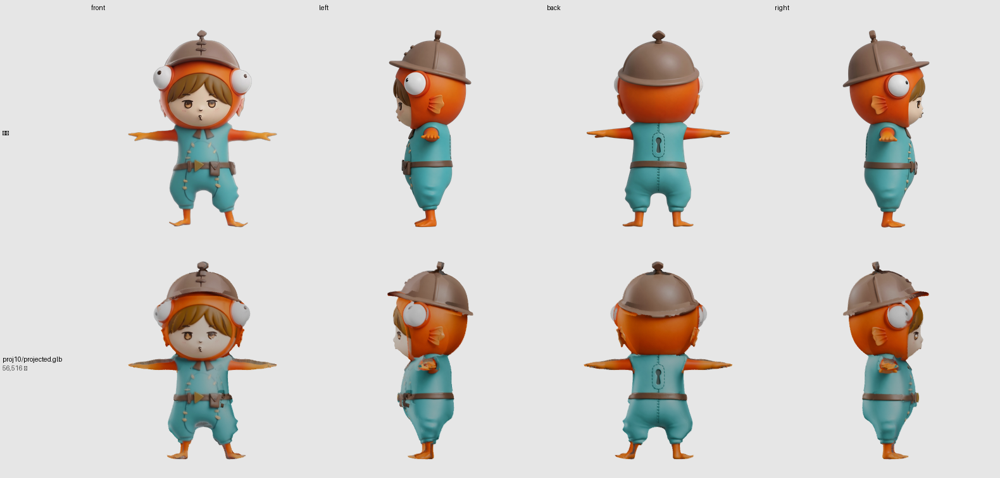

上段が元絵、下段が出来上がり（照明なし・テクスチャそのまま）。
顔・前髪・目・ベルトの三角バックルとポーチ・縫い目・背中の鍵穴・横のひれ・フードの目玉が出ている。

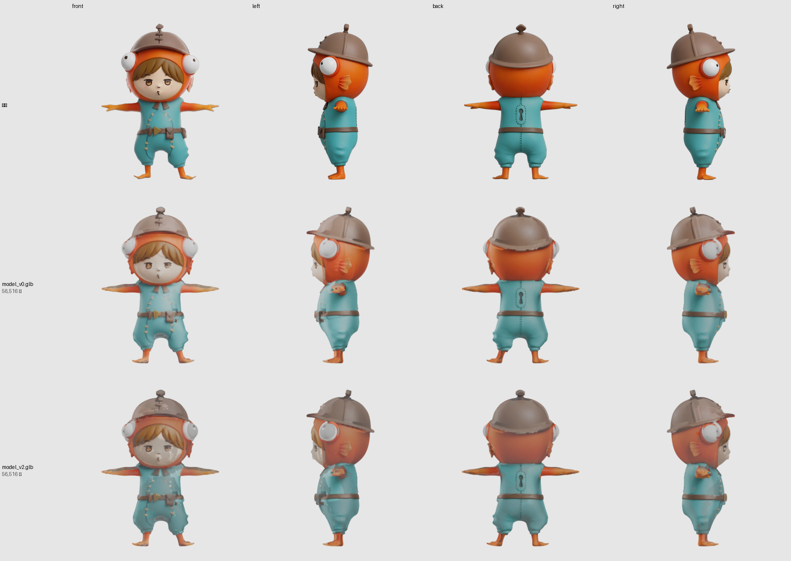

Eevee（実際の照明あり）。中段が v0（アルベドのみ）、下段が v2（法線＋AO 付き）。
**v0 を成果物にした。** v2 は縫い目の立体感が出る代わりに、顔にざらつきと暗い筋が乗る
（TRELLIS.2 の微細な彫りのノイズが焼き込まれる）。

## 工程と、そこで決めたこと

| # | 工程 | 使ったもの | 決めたこと・分かったこと |
| ---: | :--- | :--- | :--- |
| 0 | 入力の確認 | `inspect_inputs.py` | 4 枚は大きさも被写体の高さも揃っていない（正面 1808px・後ろ 991px）。**投影では向きごとに位置合わせが要る** |
| 1 | 形の候補を 4 つ | `gen_candidates.py`（TRELLIS.2 × mode/res/seed） | `concat` は**浮いた破片**が出る。`1536` は顔の彫りが深すぎる。`s7` はフードの目玉が元絵に近い。**本線は s1234**（体の比率が近い） |
| 2 | 流れのあるリトポ | `retopo_flow.py`（ボクセル → QuadriFlow → スナップ） | 28k 四角・manifold。ボクセル 42k と同等の細部。**glb 書き出しには材質を付けないと UV が落ちる** |
| 3 | UV | `uv_xatlas.py` | Smart UV Project は島が砕けて継ぎ目が無数に出た。xatlas で 429 島・利用率 70% |
| 4 | **元絵の直接投影** | `project_refs.py`（nvdiffrast） | 下記 |
| 5 | ハイ→ロー ベイク | `bake_normals.py`（Cycles OptiX） | 法線・AO は焼けたが、この題材では**顔を悪くする**。ならした形から焼く改良が要る |
| 6 | 組み立て | `assemble_final.py` | アルベド＋（任意で法線・AO）→ glTF の向き（Y 上）へ |
| 7 | 見比べ | `compare_clay.py` | 4 方向・正射投影・同じ高さで元絵と並べる。`--flat` で照明を外し、`--eevee` で法線まで描く |

### 形の候補（工程 1）

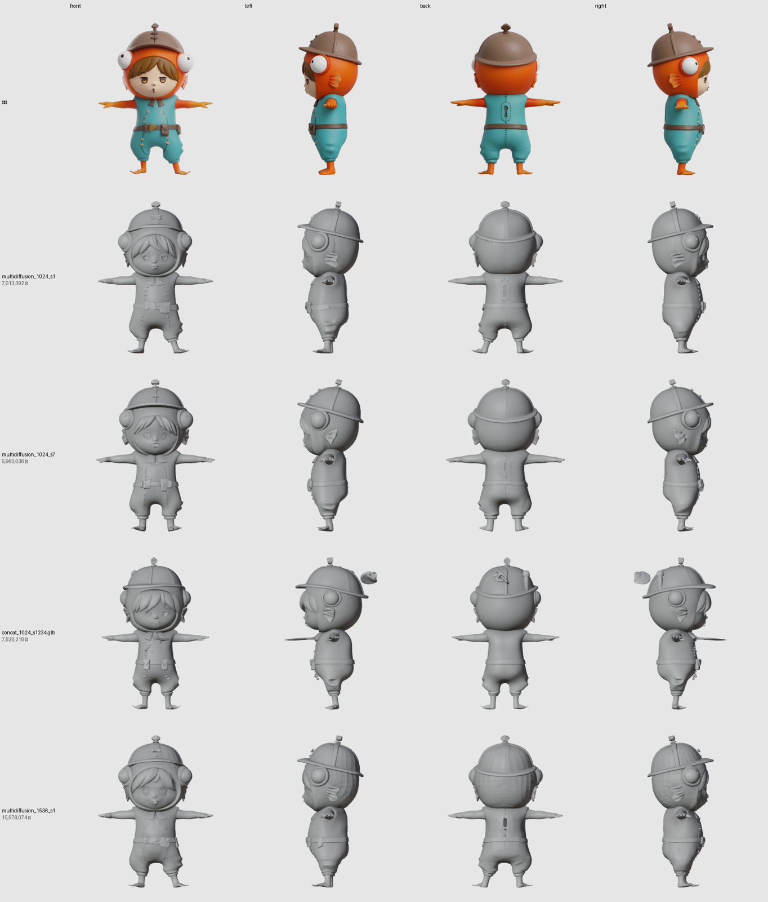

### リトポロジー（工程 2）

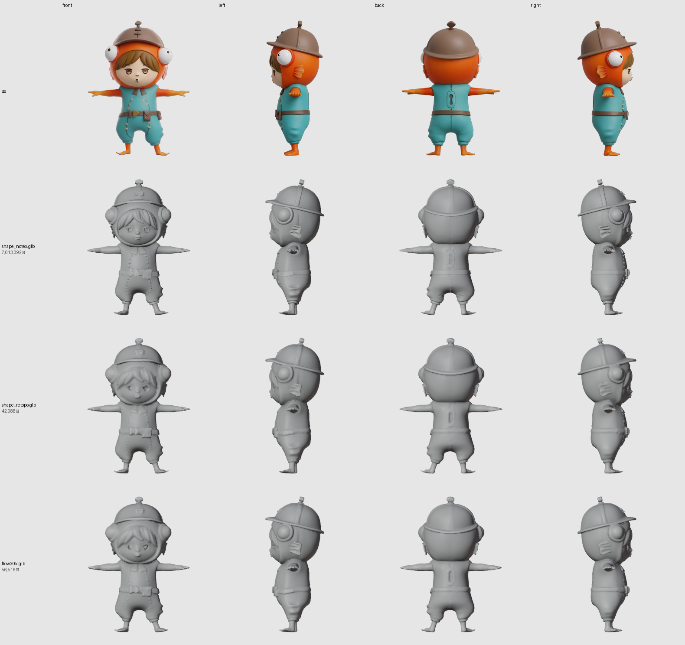

## 直接投影で踏んだ罠（工程 4）

**この工程だけで 10 回作り直した。** 順に書く。どれも描画を見て見つけた。

| 回 | 症状 | 原因 | 直しかた |
| ---: | :--- | :--- | :--- |
| 1 | 全体が暗い | 元絵は陰影入り。描画がさらに照明を掛けて二重に暗い | 判定は `--flat`（照明なし）で行う |
| 2 | 前後が入れ替わる | シルエット IoU で向きを自動対応づけ。**T ポーズの前後はほぼ同じ**で区別できない | 規約で固定（front=0°, back=180°）。ツールで顔が裏に付いた件と同根 |
| 3 | 胴にオレンジの斑 | 塗り残しを **UV 空間の最近傍**で埋めた。UV で隣の「腕の島」から色を借りる | 島の中でだけ広げる → さらに **3D 空間の最近傍**へ |
| 4〜6 | 斑が消えない | 横の絵で「カメラ側に伸びた腕」が胴を隠す画素を拾う、と推測して門・遮蔽境界の膨張を入れた | **どちらも外れ。** 推測をやめて向きごとに単独で貼って見た |
| 7 | 描画の全行が同じ | **描画スクリプトのバグ**。同名 `projected.glb` を並べると中間画像が上書きされる | 行番号を付けた。**それまでの比較の一部は無効だった** |
| 8 | 基準色で門をすると灰色のにじみ | 基準色を UV の島で広げたので兜の茶がフードに乗る | 3D 最近傍に変更（それでも横の色の門は逆効果 → **門は使わない**） |
| 9 | 貼れたテクセルが 5〜6 割しか無い | 可視判定の深度比較が「かすった角度」で厳しすぎた | 三角形 ID の一致でも可視とする |
| **10** | **IoU が 0.6 しか無い** | **nvdiffrast のラスタ画像は下から上（OpenGL 流儀）。元絵は上から下。可視判定が鏡像の位置を見ていた** | 上下を返す。IoU 0.60 → **0.94**、貼れたテクセル 53% → **74%** |

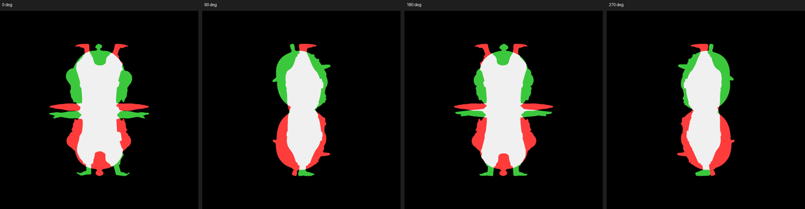

赤＝メッシュの輪郭、緑＝元絵の輪郭。頭が上下逆に重なっている。
**10 回目の修正がほぼすべての症状の真因**で、1〜9 の多くはこの上に積んだ対症療法だった。
「顔は出ていた」のは、色の取得だけは正しい向きで行っていたため。

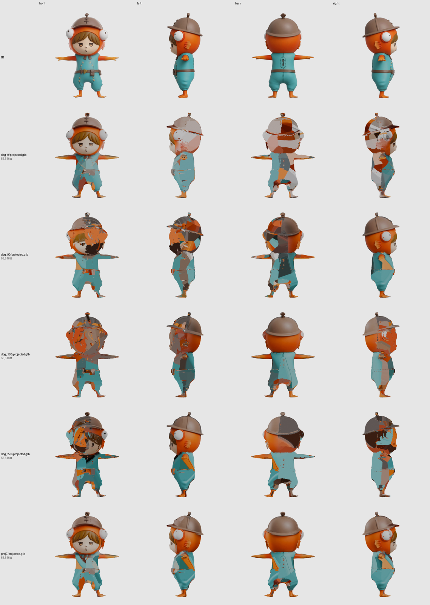

上から: 前だけ・右だけ・後ろだけ・左だけ・全部。**前と後ろは単独でほぼ完璧**。

### 最終的な投影の作り

- 4 方向の正射投影。向きは規約で固定（front=0°・right=90°・back=180°・left=270°）
- 元絵は**高さ**でメッシュのシルエットに合わせる（横幅はポーズ差で一致しないため）
- テクセルごとに: 法線とカメラ方向の cos が 0.2 以上 → 重み cos⁴。可視は「その画素を覆う三角形が自分」または深度差 0.02 以内
- 塗り残しは **3D 空間で最も近い**貼れたテクセルの色で埋める（UV の隣ではなく）
- 3D 近傍 24 点の中央値から遠いテクセルは中央値に置き換える（小さな斑を消す）
- 横の絵の重みは前後の半分

## 数値

| 項目 | 値 |
| :--- | ---: |
| 形（s1234） | 3,460,150 頂点 / 7,013,392 面 / 111 秒 |
| リトポ（QuadriFlow） | 28,258 四角 / 100% 四角 / おかしな辺 0 |
| UV（xatlas） | 429 島 / 利用率 70.2% |
| 投影 IoU（front / right / back / left） | 0.903 / 0.944 / 0.930 / 0.932 |
| 貼れたテクセル（島の中） | 73.7% |
| 成果物 | 56,516 三角 / 2048² アルベド / 3.7MB |

## 何がまだ足りないか（元絵と並べて）

- **手**: メッシュの手が薄く、オレンジの塊にしか見えない。形の限界
- **顔**: 目・口は出ているが、元絵より少し柔らかい。頭だけ 4096² にすれば締まる見込み
- **継ぎ目**: 前後と横の境で色の段差がわずかに残る
- **法線・AO**: 微細ノイズを焼き込む。**ならした形から焼く**か、頭には使わない。
  さらに**法線マップ自体が壊れている**（UV の島ごとに黄土色＝(0.5,0.5,0)＝法線の Z 成分が 0）。
  面の向きの再計算・継ぎ目の頂点結合では直らなかった。島ごとに出ることから
  タンジェント基底（UV が鏡像の島）が疑わしい。オブジェクト空間で焼いて切り分けるのが次の一手。
  **v0 を成果物にした理由の1つ**
- **陰影の二重掛け**: 元絵の陰影がアルベドに入ったままなので、照明を強く当てると不自然になる。
  デライト（陰影の除去）は未着手

## ツールへの落とし込み（提案）

| 今の工程 | 置き換え |
| :--- | :--- |
| 塗り（Hunyuan3D-Paint） | **元絵の直接投影を主役に**し、AI 塗りは投影で貼れなかった面の穴埋めに降格 |
| リトポ（ボクセルのみ） | ボクセル → QuadriFlow → スナップ |
| UV（AI 任せ） | xatlas。頭のパーツは別アトラス（4096） |
| 形（1 回生成） | seed 違いを 2〜3 個作って IoU と目視で選ぶ |
| 判定 | 各工程で 4 方向を描画して元絵と並べる。数字だけで進めない |

**投影の実装は 200 行程度で、nvdiffrast は既に venv にある。** 塗り環境（venv-21）の借り物より依存が軽い。

## 追記（2026-09-05）: 斜めから見たら壊れていた

利用者がビューアで斜め上から見た画面を示して指摘: **着ぐるみの目が崩れている・手の色が左右で違う・色にムラがある。**
すべて事実だった。

**見逃した原因は判定方法。** 4 方向の正射投影＝投影に使った角度そのものでしか見ていなかった。
同じ角度から見れば元絵が貼ってあるので必ず一致して見える。斜め上・斜め下・透視投影で描いて初めて
「4 方向のどこからも見えていない面」の埋め色が見える。以後は `turntable.py`（方位 8 × 仰角 +60/+30/−15/−45、透視）で判定する。

### 出どころを色分けして原因を確定した

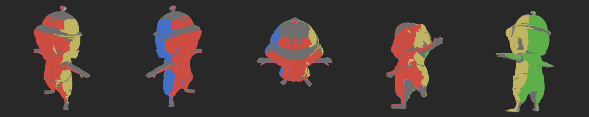

赤=前・緑=後・青=右・黄=左・**灰=どこからも貼れず埋めた面**（島の 26%）。帽子の天面・頭頂・腕と手の上面・股・足の裏がすべて埋め。

| 症状 | 確定した原因 | 直しかた |
| :--- | :--- | :--- |
| 服・帽子の斑（三角形状） | UV ラスタ等倍で島の中に点々と空きテクセル → 埋め色が入る | UV ラスタを 2 倍で描いて縮める |
| 股・腹の下の**泥色** | 距離加重平均の埋めが、ズボンの青・ベルトの茶・足の橙を混ぜた（最初の対策が逆効果） | **島の境界から広げる → 島ごと空いた所だけ 3D 最近傍 → 埋めた所だけ局所平滑**（`coherent_fill`） |
| 腕・手の甲の**灰茶の筋** | 絵の縁の半透明画素は RGB に黒が混ざっている（実測 (28,27,26)）。メッシュの腕が絵の腕より太く、上面が輪郭の外を指す。輪郭の外へ色を延ばす処理がその縁の色を放射状に引いた | 延ばす元を「完全に不透明な内側を 2px 削った画素」に限定。延ばす帯は 8px、外れた面は埋めに回す |
| 下から見た顎に口が伸びる | cos^p の重みだと 60° の面にも重みが残る | 重みを (cos−0.5)/0.5 の 3 乗に。50° を超える面は自然に埋めへ |
| 指先の水色 | 横の絵で手が胴に重なり、メッシュの手の断面が絵の手より大きい所が服の色を拾う | **未解決。** 「別の向きから絵の外に出ている面は捨てる」「前後の絵との合議」を試したが、指先の下面は前後から全く見えず効かなかった |
| 目玉が後ろから見ると橙の斑 | 目の裏側はどこからも見えず、目と同じ島にフードの橙があるため埋めで混ざる | **未解決。** s7 の形でも同程度（体は縦に伸びて悪化）→ s1234 のまま |

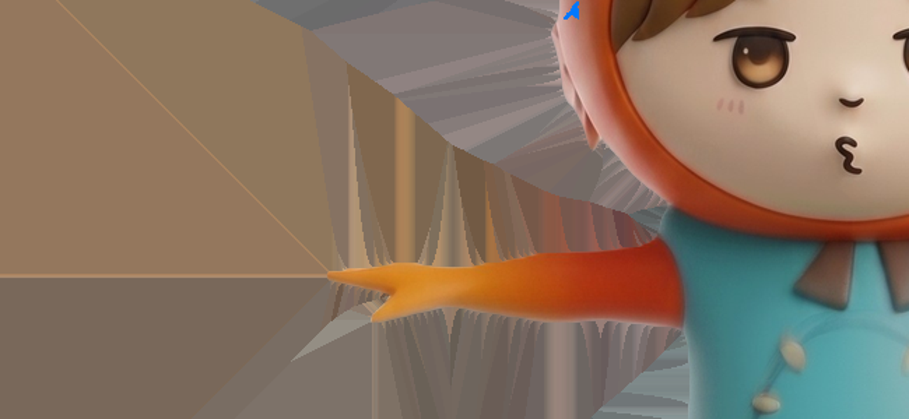

輪郭の外へ延ばした色（デバッグ画像）。腕の上に灰茶の放射が出ている。これが筋の正体。

### v0 → v1

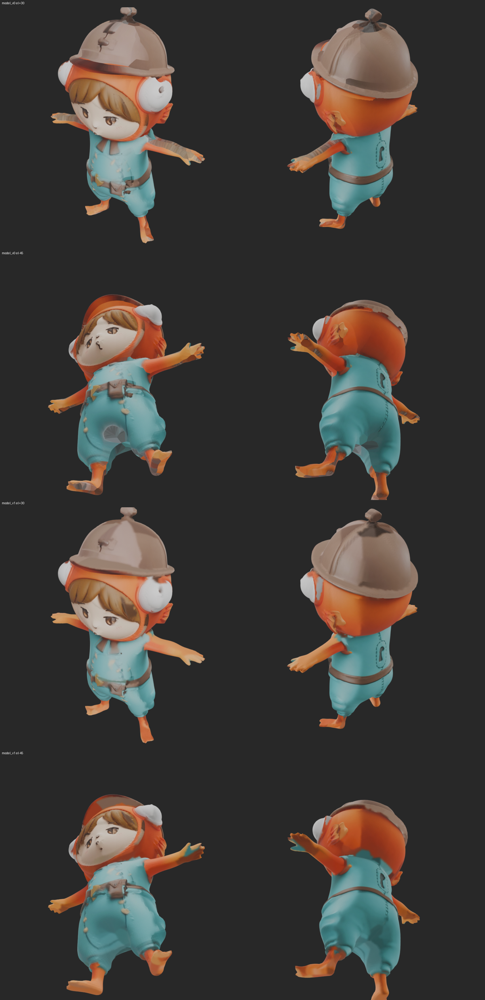

上 2 段が v0、下 2 段が v1（方位 30°/135°、仰角 +30°/−45°）。腕の縞・腹の泥色・服の斑が消えた。

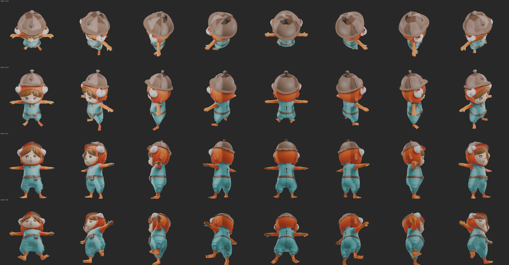

| 項目 | v0 | v1 |
| :--- | ---: | ---: |
| 埋めた面（島の中） | 26.3% | **40.3%**（かすった角度を捨てた分が増える。埋めが均一になったので見た目は改善） |
| 成果物 | `final/model_v0.glb` | `final/model_v1.glb`（Mac: `out/handcraft_model_v1.glb`） |

### まだ足りないもの（v1 を斜めから見て）

- **目玉の裏**の橙の斑、**下から見た顎**の口の伸び、**指先**の水色 — 上表の未解決 2 件＋顎
- **首の継ぎ目**がギザギザ（フードと服の境。形の問題）
- **手の形**が薄い板（形の問題）
- **元絵の陰影がアルベドに残る**（デライト未着手）

**ツールへの落とし込みで必須になったこと**: 判定は 4 方向の正射投影ではなく **斜めを含む多方向の透視投影**で行う。
埋めは「島の境界から広げる」方式。投影の許容角は 50°（それ以上は埋め）。輪郭の外へ延ばす色は完全不透明の内側から取る。

## 追記 2（2026-09-05 夕）: ギザギザ・板状の手・目の穴の正体はリトポだった → v2

利用者の指摘: 「被り物と顔の境界などがギザギザ」「手が手の形をしていない」「顔の目に穴」「見えない部分は同じ色に」。

### 切り分け: テクスチャ無しの素の形を並べた

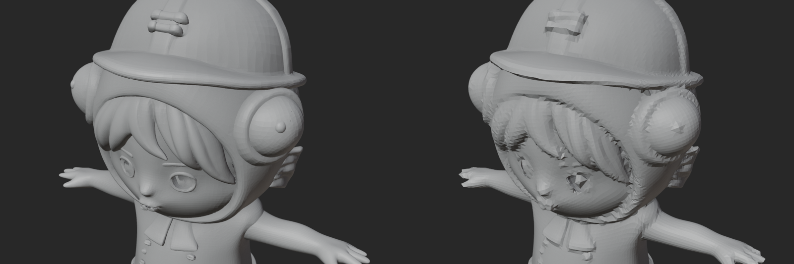

左＝生成直後の形（700 万面）、右＝私が「流れのあるリトポ」にした 28k 四角。
**生成直後の形は帽子・フードの縁・髪・目玉・指・ボタンまで滑らか。壊したのは私のリトポ工程**
（ボクセル 0.009 → QuadriFlow 28k → スナップ）。ギザギザ・板状の手・多角形の目の穴は全部ここで生まれていた。

### 形の作り直しで踏んだ罠

| 試み | 結果 | 分かったこと |
| :--- | :--- | :--- |
| 生成メッシュを直接 40 万面へ削減 | 貼れた面 37%・色違いの斑 | 生成メッシュは**巻き（面の裏表）が揃っていない**（外向き 46%）。**6.4 万個の部品**に分かれ、xatlas が部品ごとに余白を取って **UV 面積が 20%** に落ちた |
| Blender で面の向きを再計算 | 63% | 非多様体なので伝播が途切れる |
| 最寄りの参照面（ボクセルリメッシュ後）と符号合わせ | 参照と一致 100%、でも貼れた面は増えず | 原因は UV 面積のほうだった |
| ボクセル 0.003 で細かくリメッシュ | フードが**レース状に穴あき** | 生成メッシュはフードが外側・内側の 2 枚（厚み 0.04）。隙間が 1 ボクセル以下でレースになる。0.009 はこれを潰して滑らかに見せていた |
| 外から見えない**部品**を落とす（42 方向から描画） | 690 万面残る | 首や袖の隙間から数面見える内側の殻が丸ごと残る |
| 外から見えない**面**を落とす（162 方向・隣接 3 段を足す） | **394 万面 → 削減 30 万面で UV 面積 65%・貼れた面 55%** | ★これが正解 |
| Smart UV Project（xatlas が 1 時間超） | 島 7 万・UV 面積 6.7% | 使えない。xatlas は反復 1 回・余白 1px なら 15〜30 分 |
| 法線は巻きに頼らず、面ごとに参照メッシュと符号合わせ → 面積重みで頂点へ | 貼れた面が戻る | `NORMAL_REF`。書き出す glb にも同じ向きの巻きと頂点法線を入れないと**ビューアで黒い斑**になる（テクスチャには黒が無かった） |

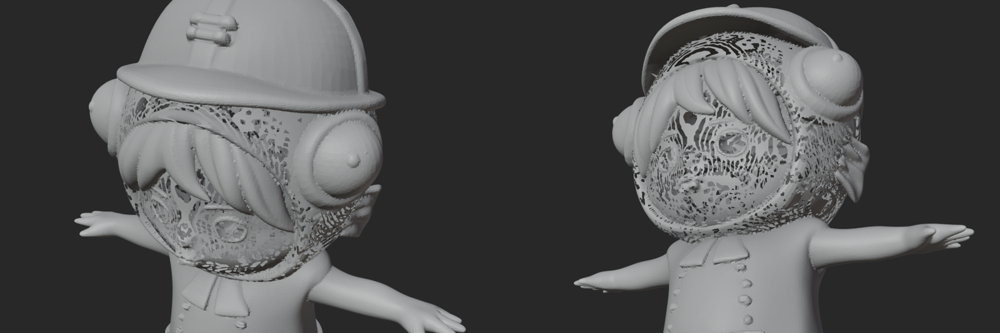

### 埋めの改良（「見えない部分は同じ色に」）

- 穴ごとに「その縁で見えている色の中央値」1 色で塗り、境目だけなじませる（`holecolor_fill`）
- 穴の連結は UV ではなく **3D 近傍グラフ**（法線が 35° 以内・距離がテクセル間隔の 6 倍以内）で取る（`holecolor3d_fill`）。
  島が 2 万個の UV では 1 つの穴が島ごとに分断されて色がバラバラになるため
- ★孤立テクセルを 0 で割って黒にするバグを踏んだ（距離上限 2.5 倍 → 6 倍、隣が無いテクセルは触らない）

### v2

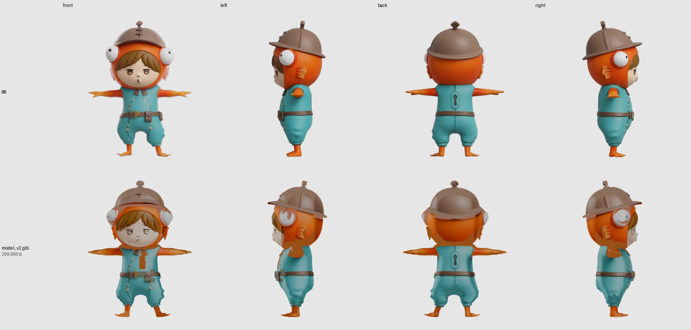

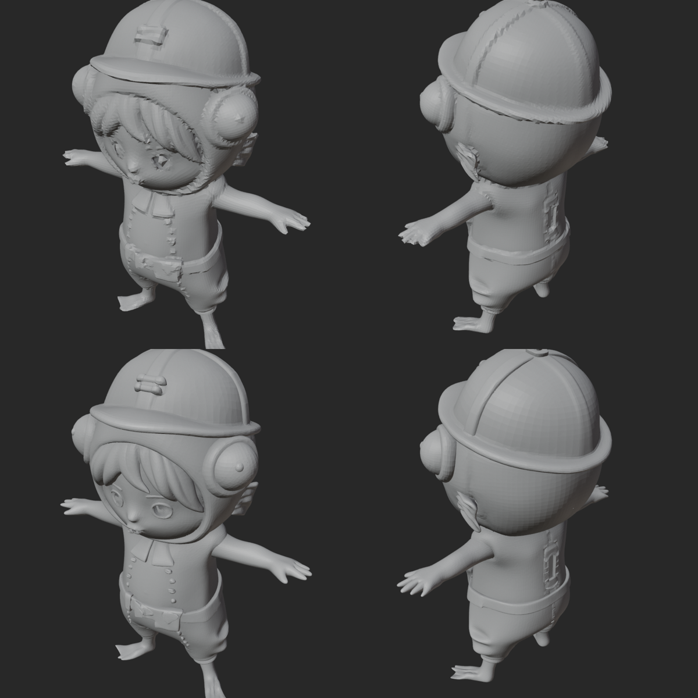

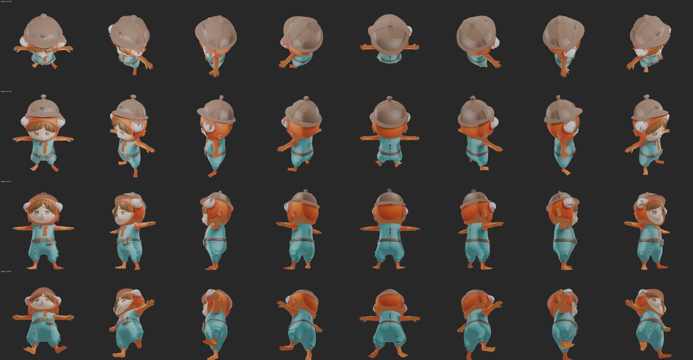

| 項目 | v1 | v2 |
| :--- | ---: | ---: |
| 形 | ボクセル 0.009 → QuadriFlow 28k 四角 | 見えない面を落とした生成メッシュを **30 万三角形**に削減 |
| UV | xatlas 429 島 | xatlas 反復 1・余白 1px・4096²、2 万島、UV 面積 65% |
| テクスチャ | 2048² | **4096²** |
| 境界のギザギザ | あり | **無し** |
| 手 | 板 | **指がある** |
| 顔の目 | 多角形の穴 | 生成どおりの浅い彫り＋絵 |
| 成果物 | `out/handcraft_model_v1.glb` 3.8MB | `out/handcraft_model_v2.glb` 21MB |

### v2 でまだ残る違和感（全角度・元絵と比較して）

| 件 | 原因 | 試した対策と結果 |
| :--- | :--- | :--- |
| **胸の中央に橙の帯** | 顎の下は正面から見えず、横の絵だけが貼る。横の絵ではそこにフードが描かれている | 遮蔽境界を広く捨てる（OCC_K 61）→ 埋めが増えフードが灰色に、**逆効果**。「正面の遮蔽物の色と同じ横の色を捨てる」→ 服の側面まで捨てて肌色に、**逆効果**。どちらも既定オフで残した |
| 被り物の目玉の上に橙 | メッシュの目玉が絵より大きく、フードの画素を拾う | 未対応 |
| 下から見た顎に口の名残 | 50° 以内の面への投影。形の顎が絵より前に出ている | 未対応 |
| 帽子の飾りから細い暗い筋 | 絵の影 | 未対応 |

**ツールへの落とし込みで変わったこと**: リトポ（ボクセル → QuadriFlow）は**捨てる**。
形は「見えない面を落とす → 削減」、法線は参照で向きを揃える、UV は xatlas（反復 1・余白 1px・4096）、
埋めは 3D 近傍グラフの穴ごと 1 色。
