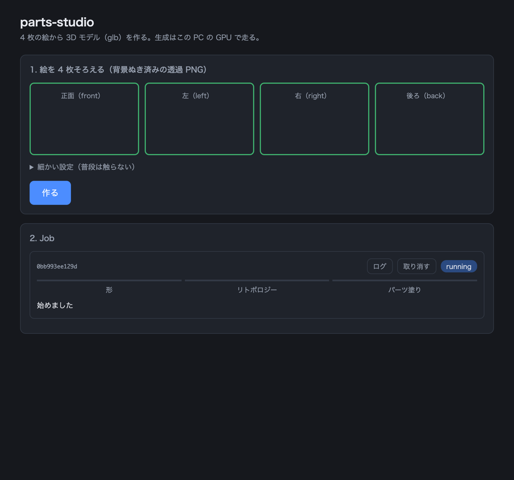

# ジョブサーバー（B-1）

ブラウザは推論しない（[ADR-0001](../adr/0001-local-job-server-browser-is-ui-only.md)）。
GPU 機でこのサーバーを立て、ブラウザはここに Job を投げて進み具合を見るだけ。

## 立てかた

```powershell
cd C:\work\parts-studio
.\venv\Scripts\python.exe tools\job_server.py
# ジョブサーバー: http://127.0.0.1:8787/jobs / Job の置き場所 ...\out\jobs
```

| 引数 | 既定 | 意味 |
| :--- | :--- | :--- |
| `--port` | 8787 | 待ち受ける口 |
| `--jobs` | `out/jobs` | Job の置き場所（入力・ログ・出来上がり） |

**待ち受けは `127.0.0.1` だけ**（同じ機体のブラウザから使う前提）。
別の機体から使うときは SSH のポートフォワードで届かせる。
リポジトリが公開なので、認証の無いままネットワークへ開かないこと。

## ブラウザ UI（B-2）

`http://127.0.0.1:8787/` を開くと UI が出る。**UI もこのサーバーが配る**
（`web/index.html`・ビルド不要の単一ファイル）。同一オリジンになるので、
UI は相対パスで API を叩けばよく、CORS も接続先の設定も要らない。

- 絵4枚をクリックかドロップで置く。**4 枚そろうまで「作る」は押せない**
  （ボタンに「あと N 枚」と出る）
- 投入すると Job カードが出て、工程の帯（形 → リトポロジー → パーツ塗り）が
  2 秒ごとに進む。`done` になったら「glb を受け取る」が出る
- ログ・取り消しもカードから
- ページを開き直しても、サーバーが覚えている Job は一覧に戻る



**実ブラウザで検証済み**（Chrome headless + puppeteer-core、偽のパイプラインを
差した本物のサーバー相手）: 0〜3枚では押せない → 4枚で押せる → 投入 →
running（工程の帯が進む）→ done → glb を受け取れる、コンソールエラーなし。

## API

| 経路 | 何をするか |
| :--- | :--- |
| `POST /jobs` | Job を積む。絵4枚（base64 の PNG）と設定を JSON で送る |
| `GET /jobs` | Job の一覧 |
| `GET /jobs/<id>` | 1つの Job の状態 |
| `GET /jobs/<id>/log` | 実行ログそのまま |
| `GET /jobs/<id>/result` | 出来上がりの glb（`done` になってから） |
| `POST /jobs/<id>/cancel` | 取り消し。実行中ならプロセスを**子孫ごと**止める |

### 投入の形

```json
{
  "images": {"front": "<base64>", "left": "<base64>",
             "right": "<base64>", "back": "<base64>"},
  "params": {"res": 1024, "seed": 1234, "texsize": 4096,
             "margin": 0.01, "voxel": 0.009, "no_fixviews": false}
}
```

- **4 View すべてが必須**（CONTEXT.md の Job の定義）。欠けると 400 で止まる。
  積んでから数分後ではなく**積む前**に弾く
- 絵は**背景ぬき済みの透過 PNG**。PNG でなければ 400
- `params` は全部任意。**既定は `run_pipeline` 側が正**（ここでは持たない）。
  値の検査は `run_pipeline` と同じ制約を積む前に掛ける
- 上限 64MB

### 状態の形

```json
{"id": "a1b2c3d4e5f6", "state": "running", "step": "shape",
 "message": "形を作っています", "error": null,
 "created": 1756608000.0, "started": 1756608001.0, "finished": null,
 "params": {}, "has_result": false}
```

- `state`: `queued` → `running` → `done` / `failed` / `canceled`
- `cancel_requested`: 取り消しを受け付けたか。**kill は非同期**なので、
  取り消しの応答時点では `state` がまだ `running` のことがある。
  UI はこれを見てから `canceled` になるのを待つ
- `step`: 実行中の工程（`shape` / `retopo` / `parts`）。
  `run_pipeline` の標準出力の「`=== N)`」の行から拾う
- **内部のパスは返さない。** GPU がローカルか遠隔かを UI に持ち込まない境界
  （ADR-0001）なので、UI がローカルのパスに依存できない形にしてある

## 作りの要点

### 標準ライブラリだけで動く

GPU 機の venv に新しい依存を入れない。`http.server` + `threading` で足りる規模
（利用者は1人、GPU は1枚、同時実行は1ジョブ）。

### Job は `run_pipeline.py` を別プロセスで実行する

1. **途中で落ちてもサーバーは生きる**（クラッシュ隔離）
2. **プロセスが終われば VRAM が必ず返る**。同一プロセスで形づくりを走らせると
   確保した VRAM が残る（[実測](../measurements/2026-08-31-run-pipeline.md)）
3. 標準出力を1行ずつ拾って進み具合に写せる

### 同時実行は1ジョブ

GPU は1枚。塗りだけで確保 20.41GB（16GB 機で辛うじて回る）なので、
並列にすると確実に OOM になる。2つ目以降は `queued` で待つ。

### 成功の条件は「glb がある」こと

終了コード 0 を信じない（`run_pipeline` 自身も、リトポロジーの終了コードが
成功でも 0 にならない実測を持っている）。**0 で終わっても出力が無ければ
`failed`、出力があっても 0 でなければ `failed`**。

### 取り消しはプロセスを【子孫ごと】止める

`proc.kill()` だけでは足りない。GPU を使う実体（リトポロジー・塗り）は
`run_pipeline` が起こす**孫プロセス**で走る。直下だけ殺すと、

1. 孫が生き残って GPU を使い続ける（取り消しても空かない）
2. 孫が stdout のパイプを握ったままなので EOF が来ず、Runner が固まって
   後続の Job も進まない

Windows の TerminateProcess は子孫に伝播しないので `taskkill /T /F` を使う。
POSIX ではプロセスグループごと止める。

### Job ごとにディレクトリを分ける

```
out/jobs/<id>/
├── input/           受け取った絵4枚（何から作ったか後から確かめられる）
├── work/            run_pipeline の中間ファイル（Job 間で共有しない）
├── log.txt          標準出力そのまま
├── status.json      状態の写し
└── model.glb        出来上がり
```

**★サーバーを立て直すと、前の Job は API からは見えない**（読み戻しは無い）。
入力・ログ・出来上がりはディスクに残るので、手で辿ることはできる。
サーバーやマシンごと落ちた場合、`status.json` は `running` のまま残る
（突き合わせる仕組みが無い）。`running` の残骸は信用しないこと。

`work/` を Job 間で共有しない理由は
[run_pipeline の実測](../measurements/2026-08-31-run-pipeline.md)の
「別の題材のものを使わないようにする」を参照。

## 検証

- テスト 63 件（`tests/test_job_server.py`）。**実際に HTTP で叩く**
  （port 0 で空いている口を借りる）。重い `run_pipeline` は代わりの
  スクリプトを差し込む。取り消しは**本物の孫プロセスを起こして、
  死んだことまで**確かめる。GPU も torch も要らない
- 変異テスト 32 種すべて捕捉（逃げ 0）。★この 32 種の範囲で、である

## 実機の通し（2026-09-03・RTX 4070 Ti SUPER 16GB）

本物の `run_pipeline` を載せて、実物の絵4枚（`testimg/`）で1回通した。

```
投入: ffef0bd59845 queued
     0s  running  -       始めました
     2s  running  shape   形を作っています
   185s  running  retopo  リトポロジーをしています
   211s  running  parts   パーツを塗っています
   473s  done     -       できました
受け取り: 10,291,204 bytes（/result 経由）
```

受け取った glb を描画して目視した。立った姿勢で、顔・目・前髪・兜が
正しい側に出ている（`run_pipeline` 直呼びの結果と同等）。

**★ssh 越しに `Start-Process` で立てたサーバーは、ssh セッションが
閉じると一緒に死ぬ**（Windows の sshd がジョブごと片付ける）。
検証は「起動 → 投入 → 見届け → 停止」を1つのセッションで行った。
常駐させるには、機体のコンソールで直接立てるか、タスクスケジューラに載せること
（B-4 [#10](https://github.com/na2-dev/parts-studio/issues/10) で扱う）。
